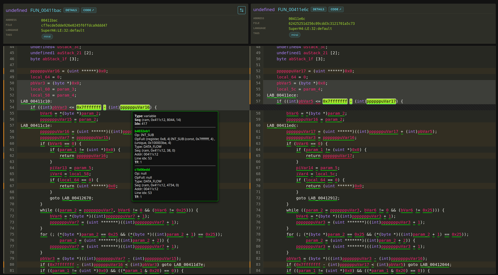
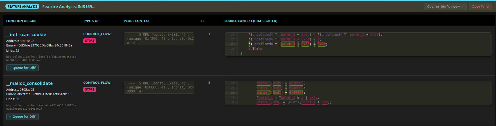

# BSimVis

BSimVis is a tool to upload large quantities of decompiled binaries from Ghidra to a redis/kvrocks server for analyzing similarity, clustering and diffing functions based on Ghidra BSIM feature vectors.
Binary analysis is done using Ghidra's decompiler thanks to Pyghidra scripting. 

# Features

- Upload decompiled functions and BSIM vectors from Ghidra to a redis/kvrocks server
- API / web interface for :
    - Correlation of decompiled funciton and BSIM features
    - Function diffing based on BSIM features
    - Feature correlation decompiled C tokens


- In the future we plan to add:
    - BSIM vector distance (cosine and others)
    - Function/binary family clustering
    - Upload function/binary families to MISP

# Web UI Diffing



# Web UI Feature usage in decompiled functions



# Requirements

- Ghidra and pyghidra install
- Redis/kvrocks server

# Upload BSIM data from CLI tool

## Usage 

```bash
usage: bsimvis [-h] [-H HOST] {setup,index,sim,batch,upload} ...

Unified BSimVis CLI

positional arguments:
  {setup,index,sim,batch,upload}
    setup               System setup
    index               Index management
    sim                 Similarity analytics
    batch               Batch management
    upload              Push data to Redis

options:
  -h, --help            show this help message and exit
  -H, --host HOST       Default Redis/Kvrocks host:port (default: localhost:6666)
```

Assuming you have a redis/kvrocks server running on localhost:6666, you can upload data using the following command:

```bash
bsimvis upload <target1> <target2> ... <targetN> --host localhost:6666 -c <collection_name> -t <tag> -n <num_threads> --config <config_file> --profile <profile_name>
```
See bsimvis_config.toml for an example config file (default config file if none is provided)


Setup Redis FT search indexes in Redis/kvrocks: (necessary for API searches)

```bash
bsimvis setup ftsearch -c <collection_name>
```


To launch the web App / API :
```bash
uv run app.py
```

Build inverted index using : 

```bash
bsimvis index build -c <collection_name>
```

Build similarities index using : (inverted index is necessary)

```bash
bsimvis sim build -c <collection_name>
```


# Adding new binaries to existing collection

```bash
$ bsimvis index status <collection_name>

[*] Indexing Status for Collection: main
Batch UUID                               | Name                           | Src Funcs  | Indexed  | Ratio 
---------------------------------------------------------------------------------------------------------
13964728-a0be-4075-b1a8-572fd8420b55     | Ghidra Batch                   | 3672       | 3670     |  99.9%
2a5e9a96-90a3-45ca-8824-514091a9d079     | Ghidra Batch                   | 19138      | 12121    |  63.3%
56a377ba-a3f8-4d7b-9080-b037c226bf90     | Ghidra Batch                   | 15         | 4        |  26.7%
759f6529-d7a5-489b-b590-93b2120fe424     | Ghidra Batch                   | 2          | 2        | 100.0%
bc847936-7bb5-4c6c-afa0-16cfeef500d6     | Ghidra Batch                   | 3          | 3        | 100.0%
```

Missing functions will be indexed with:

```bash
bsimvis index build <collection_name>
```

To index a specific batch:

```bash
bsimvis index build <collection_name> --batch <batch_uuid>
```

To rebuild a specific batch:

```bash
bsimvis index rebuild <collection_name> --batch <batch_uuid>
```
