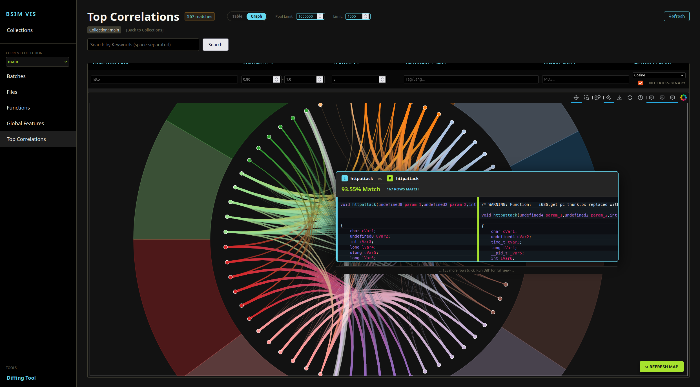

# BSimVis

BSimVis is a tool to analyze similarities across a collection of binaries, based on [Ghidra](https://github.com/nationalsecurityagency/ghidra) analyzers and the BSim (Behavioral Similarity) plugin. It provides an API and Web interface to upload large quantities of decompiled binaries and BSim feature vectors to a Kvrocks database for similarity analysis, function diffing, and family clustering.

BSimVis uses a custom database because Ghidra's BSim databases don't store decompiled code and other metadata. This alternative BSim database and API provide filtering and visualization of this additional data across multiple binaries at once. It doesn't aim to replace Ghidra's BSim plugin, but to enable more advanced analysis and visualization of the similarities on a large scale (family clustering, etc.).

# Features

- Upload decompiled functions and BSIM vectors from Ghidra to a kvrocks database
- API / web interface for :
    - Similarity of decompiled function and BSIM features
    - Function diffing based on BSIM features
    - BSim Feature correlation with decompiled C tokens / Pcode blocks


- In the future we plan to add:
    - BSIM vector distance (cosine and others)
    - Function/binary family clustering
    - Upload function/binary families to MISP

# Web UI Diffing


# Web UI Feature usage in decompiled functions


# Web UI Similarity Search Graph view



# Requirements

- Ghidra and pyghidra install
- Redis and kvrocks databases

# Upload BSIM data from CLI tool

## Usage 

```bash
usage: bsimvis [-h] [-H HOST] {features,index,sim,job,worker,upload} ...

Unified BSimVis CLI

positional arguments:
  {features,index,sim,job,worker,upload}
    features            BSim Feature management (Indexing)
    index               Index health and statistics
    sim                 Similarity management
    job                 Job & Pipeline management
    worker              Worker management
    upload              Upload binaries to redis/kvrocks

options:
  -h, --help            show this help message and exit
  -H, --host HOST       API host:port (default: localhost:5000)
```

To launch the web App / API :
```bash
uv run app.py
```

To start the workers (required for indexing and similarity processing)
```bash
uv run bsimvis worker start --count 5
```

Assuming you have the API running, you can upload data using the following command:

```bash
bsimvis upload <target1> <target2> ... <targetN> -c <collection_name> -t <tag> -n <num_threads> --config <config_file> --profile <profile_name>
```
See `bsimvis_config.toml` for an example config file.

To see the indexing / similarity processing jobs status:

```bash
uv run bsimvis job list
```

To see the status / logs of a specific job:

```bash
uv run bsimvis job status <job_id>
```

To cancel a job:

```bash
uv run bsimvis job cancel <job_id>
```