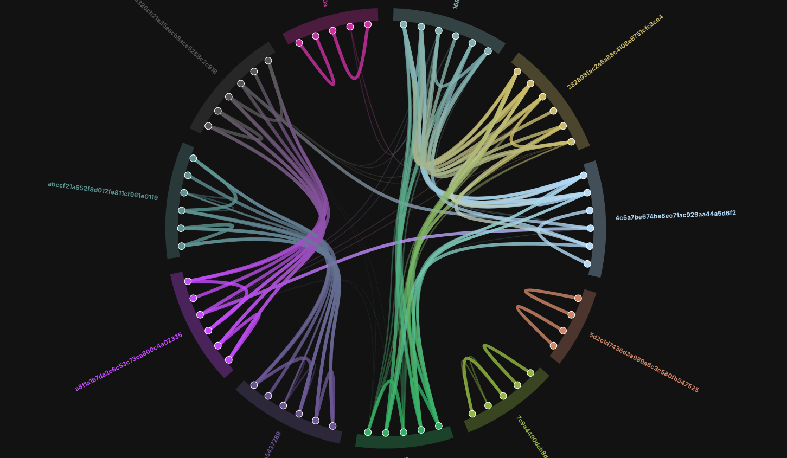
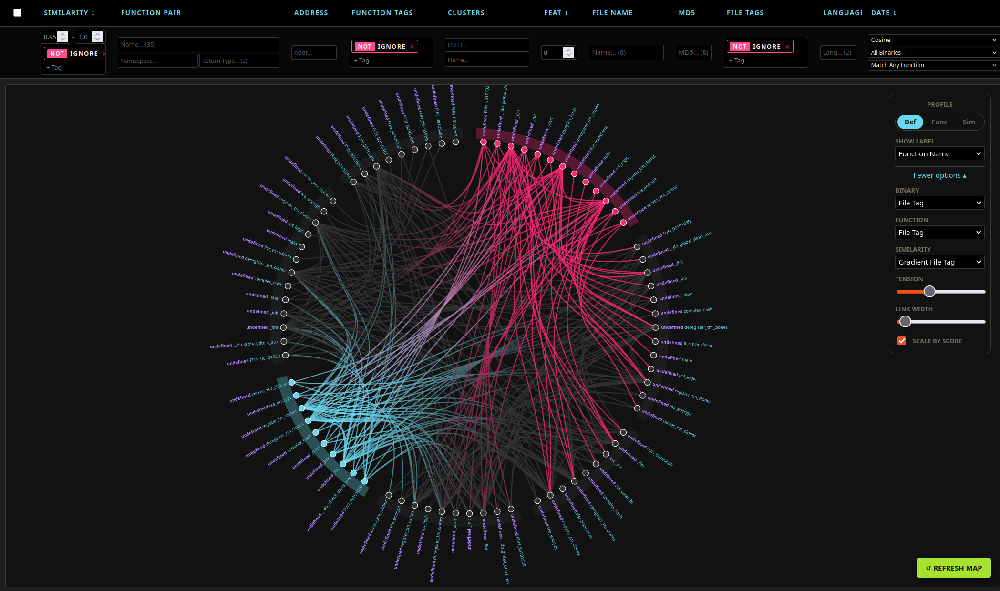
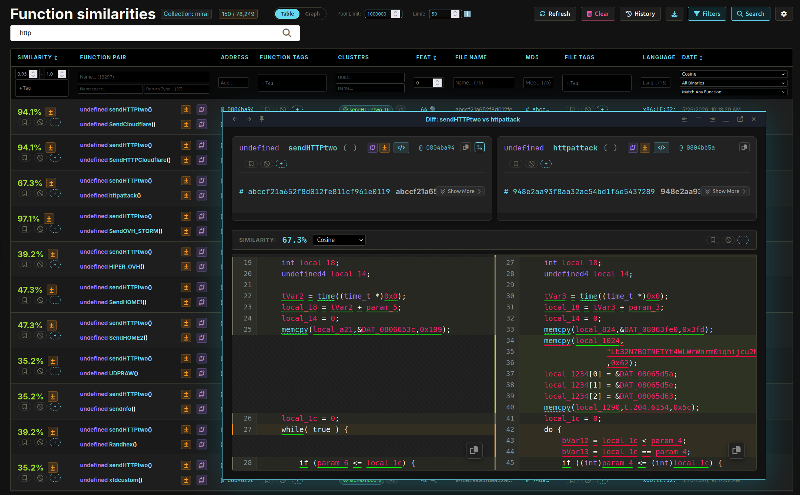
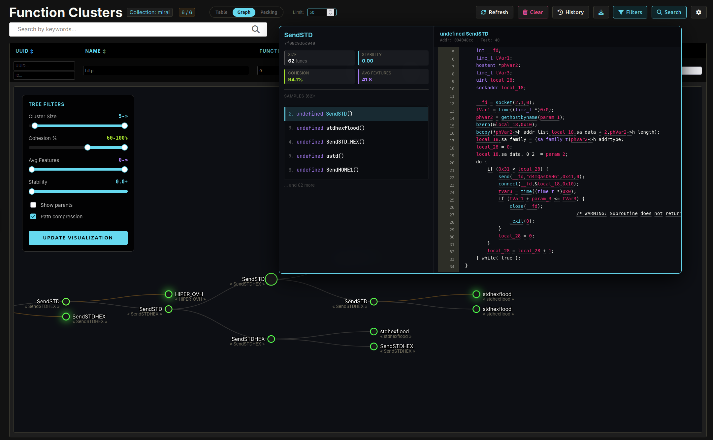

# BSimVis

<p align="center">
  
</p>

BSimVis is a tool to analyze similarities across a collection of binaries, based on [Ghidra](https://github.com/nationalsecurityagency/ghidra) analyzers and the BSim (Behavioral Similarity) plugin. It provides an API and Web interface to upload large quantities of decompiled binaries and BSim feature vectors to a Kvrocks database for similarity analysis, function diffing, and family clustering.


BSimVis uses a custom database because Ghidra's BSim databases don't store decompiled code and other metadata. This alternative BSim database and API provide filtering and visualization of this additional data across multiple binaries at once. It doesn't aim to replace Ghidra's BSim plugin, but to enable more advanced analysis and visualization of the similarities on a large scale (family clustering, etc.).



# Features

### Analysis
- Upload decompiled functions and BSim vectors from Ghidra
- Similarity search with score filtering across multiple binaries
- Function diffing based on BSim features
- BSim feature correlation with decompiled C tokens / Pcode blocks
- Call graph navigation (callers and callees)

### Clustering
- HDBSCAN-based binary family clustering
- Cluster search view with dendrogram and packing diagram
- Stability and parent cluster filtering

### Search & Filtering
- Full text search on files and features with sorting, filtering, and pagination
- Search history and caching

### Web Interface
- Similarity graph
- Dynamic window management for multiple code previews
- Tag management for files, functions, and similarities
- Quick preview tooltips for clusters and diffs
- Table selection and copy across all views

### API
- REST API with Swagger documentation
- Upload API: processor/compiler config, profiling, batch metadata, and similarity params

# Screenshots


## Web UI Similarity Search Graph view



## Web UI Diffing



## Web UI Cluster Dendrogram 



# Requirements

- Ghidra and pyghidra install
- Redis and Kvrocks databases

# Installation

Run the install script to set up portable Redis, Kvrocks, and optionally Ghidra:

```bash
./install.sh
```

Milvus support is optional and can be enabled via the `.env` file (`ENABLE_MILVUS=true`).

# Running

Use the launch script to start all services in screen sessions:

```bash
./launch.sh
```

Use `--clear` to kill stale sessions before restarting:

```bash
./launch.sh --clear
```

Services are configured via `.env` (see `.env.example`). Key variables:

| Variable | Default | Description |
|---|---|---|
| `KVROCKS_PORT` | `6666` | Kvrocks database port |
| `REDIS_PORT` | `6379` | Redis job queue port |
| `APP_PORT` | `5000` | API / Web UI port |
| `WORKERS_COUNT` | `5` | Number of background workers |
| `DATA_BASE_DIR` | `./data` | Storage path for all service data |
| `ENABLE_MILVUS` | `false` | Enable optional Milvus vector DB |

# Test script

```
uv run test_api_endpoints.py
```
# CLI

## Upload BSIM data

Assuming you have the API running, upload data using:

```bash
uv run bsimvis upload <target1> <target2> ... <targetN> -c <collection_name>
```

See `bsimvis_config.toml` for an example config file.

## Job management

```bash
# List all jobs
uv run bsimvis job list

# View logs of a specific job
uv run bsimvis job status <job_id>

# Cancel a job
uv run bsimvis job cancel <job_id>
```

## Worker management

```bash
# Start workers
uv run bsimvis worker start --count 5
```

## Building clusters

For now clustering is a manual job to run after ingesting all binaries. 

```bash
uv run bsimvis cluster build -c <collection_name>
```

## Full CLI reference

```
usage: bsimvis [-h] [-H HOST] {features,index,sim,job,worker,upload} ...

Unified BSimVis CLI

positional arguments:
  {features,index,sim,job,worker,upload}
    features            BSim Feature management (Indexing)
    index               Index health and statistics
    sim                 Similarity management
    job                 Job & Pipeline management
    worker              Worker management
    upload              Upload binaries to redis/kvrocks

options:
  -h, --help            show this help message and exit
  -H, --host HOST       API host:port (default: localhost:5000)
```
