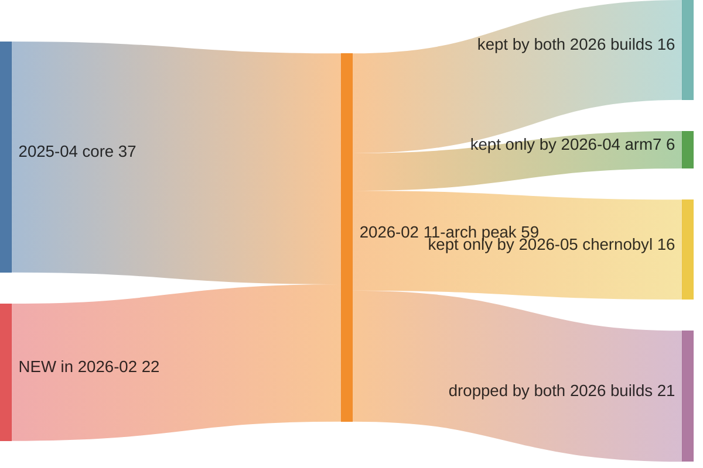

# Kaiten/STD in `mirai_unpacked_and_renamed3` — the generation that *subtracts*

Companion to [`unpacked3_family_report.md`](unpacked3_family_report.md), and a
direct revision of [`mirai7_kaiten_timeline.md`](mirai7_kaiten_timeline.md).

The mirai7 timeline ended on a strong claim:

> *"Read across the diagram: **no flow terminates at 2025-04.** Nothing was
> dropped, nothing was replaced. The 2026-02 build is the 2025-04 build plus 22
> functions."*

That was true of the ten Kaiten files then visible. This collection adds five
more, two of them **later than anything in `mirai7`**, and they break it. The
family's most recent builds are smaller than its 2026-02 peak, and they are
smaller in a specific, deliberate place.

---

## 1. The population — 10 files became 15

> **Pivot** — identical to the mirai7 method, and it is still the cheapest thing
> in the report: take the 59-name Kaiten malware vocabulary, intersect it with
> the per-file symbol sets from one bulk
> `function/search?collection=…&limit=120000`. No per-file calls.

| File | Arch | Fns | First seen | Kaiten syms | vs `mirai7` |
|---|---|---:|---|---:|---|
| `7b70ace…` (**A**) | MIPS:LE:32 | 213 | **2025-04-04** | 37 | present |
| `botnet` | SuperH4:LE:32 | 628 | 2026-02-09 | 59 | present |
| `cock` | MIPS:BE:32 | 591 | 2026-02-09 | 59 | present |
| `net` | MIPS:LE:32 | 596 | 2026-02-09 | 59 | present |
| `cracknet` | PowerPC:BE:32:e500 | 577 | 2026-02-09 | 59 | present |
| `dicknet` | ARM:LE:32:v8 | 638 | 2026-02-09 | 59 | present |
| `unet` | ARM:LE:32:v8 | 584 | 2026-02-09 | 59 | present |
| `fucknet` | x86:LE:32 | 596 | 2026-02-09 | 59 | present |
| `swatnet` | x86:LE:64 | 568 | 2026-02-09 | 59 | present |
| **`gaynet`** | **68000:BE:32 (Coldfire)** | 690 | 2026-02-09 | 59 | **new** |
| **`ballnet`** | ARM:LE:32:v8 | 604 | 2026-02-09 | 59 | **new** |
| **`weednet`** | x86:LE:32 | 596 | 2026-02-09 | 59 | **new** |
| `m-p.s-l.dick` | MIPS:LE:32 | 570 | 2026-03-01 | 12 | present (fork) |
| **`arm7`** | ARM:LE:32:v8 | 323 | **2026-04-18** | **22** | **new** |
| **`chernobyl.mips`** | MIPS:BE:32 | 1 340 | **2026-05-31** | **32** | **new** |

Plus five stripped files attributed to the family by function-cluster overlap
(§5) — 20 in total, double the mirai7 count.

**The 2026-02-09 build set is now 11 files, not 8.** `gaynet` (m68k), `ballnet`
and `weednet` all carry the same 59 malware symbols, pairwise Jaccard 1.00, same
`first_seen` day. The mirai7 conclusion — one `make` run, one source tree, one
upload — holds; the run just covered **11 targets across 8 Ghidra language IDs**,
including Coldfire/68000, which the first report did not know was in scope.

*(A twelfth file shares that 2026-02-09 timestamp — `8cf35e8a…`, MIPS:LE, 191
functions — but it carries no Kaiten symbol and clusters with Mirai's `mipsel`
at 0.70. Same upload, different family. Timestamp is not attribution.)*

## 2. The timeline — now three points, and the third goes backwards

```
2025-04-04   A                37 malware fns    MIPS:LE only
2026-02-09   11 samples       59 malware fns    8 language IDs   ← peak
2026-03-01   m-p.s-l.dick     12 malware fns    lifted substrate (fork, mirai7 §4)
2026-04-18   arm7             22 malware fns    ARM only
2026-05-31   chernobyl.mips   32 malware fns    MIPS:BE only
```

Bucket-by-bucket, using the mirai7 role buckets unchanged (kept / bucket size):

| Bucket | A 2025-04 | **11-arch 2026-02** | fork 2026-03 | **arm7 2026-04** | **chernobyl 2026-05** |
|---|:-:|:-:|:-:|:-:|:-:|
| C2 transport | 9/9 | 9/9 | 4/9 | 6/9 | 8/9 |
| dispatch + runtime | 5/5 | 5/5 | 2/5 | 2/5 | 5/5 |
| L3/L4 floods | 12/12 | 12/12 | 0/12 | 7/12 | 10/12 |
| packet crafting + RNG | 7/7 | 7/7 | 5/7 | 1/7 | 7/7 |
| output helpers | 4/4 | 4/4 | 0/4 | 3/4 | **0/4** |
| L7 / CDN *(new in 2026-02)* | — | 6/6 | 0/6 | **1/6** | **0/6** |
| provider bypass *(new in 2026-02)* | — | 6/6 | 0/6 | **0/6** | **0/6** |
| L3/L4 additions *(new in 2026-02)* | — | 4/4 | 0/4 | 1/4 | 1/4 |
| competitor eviction *(new in 2026-02)* | — | 2/2 | 0/2 | **0/2** | **0/2** |
| support *(new in 2026-02)* | — | 4/4 | 1/4 | 1/4 | 1/4 |

Read the last two columns. Both 2026 builds keep the **original 2025-04 core**
nearly intact (chernobyl 30 of 37, `arm7` 19 of 37) and discard almost the whole of what
2026-02 added — 20 of the 22 new functions gone in chernobyl, 19 of 22 in
`arm7`. The two anti-mitigation buckets that the mirai7 report identified as the
*entire* direction of the family's growth (`SendCloudflare`, `SendOVH_STORM`,
`HIPER_OVH`, `SendDOMINATE`, `sendHLD`, `SendHOME1/2`, `httpattack`, `sendTLS`)
are at **0/12** in chernobyl and **1/12** in `arm7`.




Flows out of the peak are disjoint: of the 59 functions, 16 survive into both
2026 builds, 6 only into `arm7`, 16 only into `chernobyl`, and **21 into
neither**.

### Two readings, and which one the evidence supports

**Reading 1 — these are older source trees rebuilt later.** Both derive from a
pre-2026-02 checkout, so they never had the L7 arsenal.

**Reading 2 — the arsenal was deliberately removed** from the 2026-02 tree.

The evidence points at 2, weakly but consistently: **both builds contain
`Randhex` and `UDPRAW`**, and both of those functions are 2026-02 additions —
they do not exist in the 2025-04 sample. `arm7` keeps one more, `SendHTTPCloudflare`. A build made from a pre-2026-02 checkout
cannot contain functions that first appeared in 2026-02. So the lineage runs
*through* the peak, and the missing functions — 21 of the 59 are in neither 2026 build — were
taken out after they were in.

Why remove them? The removed set is exactly the noisy, signature-rich part: the
CDN-bypass HTTP strings, the OVH/`HOME` provider-specific paths, and
`competitiveKiller`/`sendKILLALL`. What survives is the quiet L3/L4 core. That
is the shape of size-and-signature reduction, not of feature regression. Stated
as the reading the evidence favours, not as fact — a second sample from either
branch would settle it.

## 3. `chernobyl.mips` is a hybrid — Kaiten network code on Mirai runtime

The single most interesting file in the collection after Vortax. 1 340
functions, statically linked, MIPS:BE, `first_seen` 2026-05-31 — the newest
sample in the corpus.

It carries **32 Kaiten symbols and 22 Mirai symbols** at the same time:

| From Kaiten | From Mirai |
|---|---|
| `initConnection` `connectTimeout` `recvLine` `sockprintf` `getOurIP` `getHost` `getArch` `getPortz` | `table_init` `table_lock_val` `table_unlock_val` `table_retrieve_val` |
| `processCmd` `main` `listFork` `trim` `fdgets` | `killer_init` `killer_kill` `killer_kill_by_port` |
| `atcp` `ftcp` `rtcp` `audp` `astd` `vseattack` `stdhexflood` `makevsepacket` `SendSTD` `SendSTD_HEX` | `rand_init` `rand_next` `checksum_generic` `checksum_tcpudp` |
| `csum` `tcpcsum` `makeIPPacket` `rand_cmwc` `init_rand` `getRandomIP` `makeRandomStr` | `util_zero` `util_strlen` `util_strcpy` `util_strcmp` `util_memcpy` `util_memsearch` `util_stristr` `util_atoi` `util_itoa` `util_fdgets` `util_local_addr` |

Two complete, *separately named* runtimes in one binary: Kaiten's `rand_cmwc` /
`init_rand` **and** Mirai's `rand_init` / `rand_next`; Kaiten's `fdgets` **and**
Mirai's `util_fdgets`; Kaiten's own checksum (`csum`, `tcpcsum`) **and** Mirai's
(`checksum_generic`, `checksum_tcpudp`). Nobody writing one bot writes both. This
is Kaiten source with Mirai's config-table, process-killer and string runtime
pasted in — the two most-copied Mirai components in the wild.

What it does **not** take from Mirai is any `attack_*` function. The attack
surface stays 100 % Kaiten. Someone wanted Mirai's `table_init` string
obfuscation and its competitor-killing `killer_*`, and nothing else.

**Caveat, and it is a real one.** This is symbol-level evidence only. Only 474 of
chernobyl's 1 340 functions land in any function cluster at cohesion ≥ 0.5, and
its `table_init`, `killer_kill` and `util_memsearch` cluster with **nothing** in
the collection. It is built with a toolchain and libc no other sample here
shares, which suppresses every similarity signal. The hybrid claim rests on the
names being present and coherent, not on BSim confirming the code is Mirai's.
A cross-collection comparison against a known-good Mirai corpus would settle it;
within this collection it cannot be settled.

## 4. The 2026-04 `arm7` — a third naming collision

Worth flagging for anyone pivoting by filename: this collection contains **three
different files called `arm7`**, and they are three different things.

| `arm7` | Fns | First seen | What it is |
|---|---:|---|---|
| `arm7` | 393 | 2026-03-20 | Mirai, `_aisuru` fork dialect (see the Mirai timeline) |
| `arm7` | 394 | 2026-04-02 | Mirai, classic dialect |
| `arm7` | 323 | **2026-04-18** | **Kaiten**, 22 malware symbols |

The mirai7 report already warned that `m-p.s-l.dick` was "a different bot" from
its filename neighbours. Same lesson, sharper: in this corpus filenames are
campaign labels chosen by the operator, they are reused across families, and they
are worth exactly nothing as attribution.

## 5. Attribution of the stripped Kaiten files

Five stripped files reach the family only through function-cluster overlap with
the labelled seeds (Jaccard ≥ 0.4 over cluster membership, ubiquitous clusters
removed). They are all MIPS or ARM, which is where the symbolised seeds are.

This is also where the mirai7 §7.4 trap is easiest to fall into, so the negative
result is worth recording explicitly: **`boatnet.mips`, `boatnet.mipsrouter` and
`boatnet.m68k` are *not* Kaiten**, despite binary-similarity scores of 0.62–0.71
against `cock` and `gaynet`. Their overlap with the Kaiten *malware* clusters is
exactly **0** — the score is their shared static libc talking. They are Mirai.

The opposite error is available too. `nova.mipsel` (599 functions, 2026-04-26)
has its highest cluster-Jaccard against `m-p.s-l.dick` (0.85), a Kaiten fork —
but `m-p.s-l.dick` is itself a hybrid that lifted Mirai's `util_*`/`table_*`
substrate (mirai7 §4), so the overlap is the *Mirai* half of it. `nova.mipsel`
carries 6 Mirai symbols and no Kaiten symbol; it is Mirai. **When a fork is a
hybrid, it is a bad seed — every neighbour it attracts must be re-checked against
which half matched.**

## 6. Conclusions

1. The 2026-02-09 build set is **11 architectures**, not 8. `gaynet` extends the
   family's reach to Coldfire/68000.
2. **The mirai7 "nothing is ever dropped" conclusion is now false.** Two builds
   later than anything in `mirai7` drop 19–21 of the 22 functions added at the
   2026-02 peak, and specifically the entire anti-mitigation arsenal.
3. Lineage still runs through the peak — `Randhex` and `UDPRAW` prove it — so
   this is removal, not an old checkout. Read it as signature reduction.
4. `chernobyl.mips` (2026-05-31, newest in the corpus) is a **Kaiten/Mirai
   hybrid**: Kaiten attacks and C2, Mirai config-table, killer and string
   runtime. Symbol-level evidence only; the file clusters with nothing.
5. Three unrelated files named `arm7`, in two families. Filenames are labels.

### Follow-ups

- Find a second sample of either 2026 branch. One more file decides
  removal-vs-old-checkout definitively.
- Diff `chernobyl.mips`'s `table_init` against a known Mirai `table_init` from a
  *different collection* — the answer is not reachable inside this one.
- The C2 host work in mirai7 §6 was not repeated here; nothing in the new files
  changes it.
