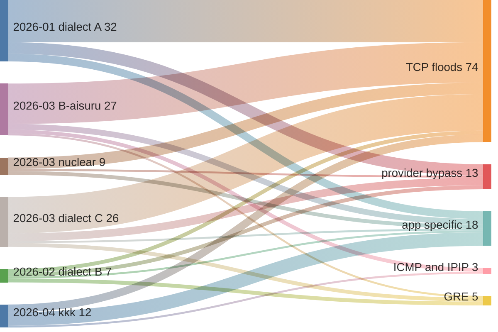

# Mirai proper in `mirai_unpacked_and_renamed3` — the timeline unpacking made readable

Companion to [`unpacked3_family_report.md`](unpacked3_family_report.md) and a
direct extension of [`mirai7_mirai_timeline.md`](mirai7_mirai_timeline.md).

The mirai7 Mirai timeline opened by explaining why it could not use the Kaiten
method:

> *"On the Mirai side, only **4 of 164 files** are symbolised … So a symbol-set
> diff across the Mirai forks compares vocabularies, not code. The unit of
> analysis has to be the **similarity cluster**."*

That constraint is now half gone. This collection has **13 Mirai samples
carrying ≥ 20 malware symbols**, and **6 of the 13 are files that were packed
stubs in `mirai7`**. The symbol method works here. The cluster method is still
needed — but now to *check* the names rather than to substitute for them, which
is a much stronger position.

---

## 1. The seed set — 4 became 13, mostly by unpacking

> **Pivot** — one `function/search?collection=…&limit=120000`, bucket function
> names per `file_md5`, count matches against
> `^(attack_|table_|xor_|scanner_|killer_|util_|checksum_|rand_|resolve_cnc|anti_gdb|watchdog)`.
> One call, 45 s, no per-file iteration.

| Seed | Arch | Fns | First seen | Syms | Dialect | Provenance |
|---|---|---:|---|---:|---|---|
| `673c690d…` | ARM | 405 | 2026-01-15 | 63 | `attack_tcpxmas` (no separator) | **unpacked** (2 fns in mirai7) |
| `parm7; 60a848d3…` | ARM | 312 | 2026-02-16 | 46 | `attack_tcp_*` | **unpacked** (4 fns) |
| `m-p.s-l.dick` | MIPS:LE | 570 | 2026-03-01 | 23 | runtime only (`util_*`, `table_*`) | in mirai7 |
| `parm7; 91e42ffd…` | ARM | 320 | 2026-03-18 | 49 | `attack_tcp_*` | **unpacked** (5 fns) |
| `arm7` | ARM | 393 | 2026-03-20 | 68 | `attack_tcp_*` **+ `_aisuru`** | in mirai7 |
| `nuclear.arm7` | ARM | 396 | 2026-03-24 | 54 | `attack_tcp_*` + `attack_method_*` | in mirai7 |
| `boatnet.arm7; 671e9d72…` | ARM | 235 | 2026-03-28 | 42 | `attack_method_*` | **unpacked** (2 fns) |
| `DEMONS.arm7` | ARM | 227 | 2026-03-29 | 42 | `attack_method_*` | new |
| `boatnet.arm7; 0cf8ec8d…` | ARM | 249 | 2026-03-30 | 55 | `attack_method_*` | **unpacked** (2 fns) |
| `DEMONS.arm7` | ARM | 227 | 2026-04-03 | 42 | `attack_method_*` | new |
| `kkk.arm7` | ARM | 290 | 2026-04-07 | 38 | `attack_method_*` | new |
| `boatnet.arm7; eb17fb7a…` | ARM | 235 | 2026-04-17 | 42 | `attack_method_*` | **unpacked** |
| `chernobyl.mips` | MIPS:BE | 1 340 | 2026-05-31 | 22 | runtime only | new (hybrid — Kaiten doc §3) |

Two more are symbolised but sit below the 20-symbol bar because they use a
vocabulary the regex does not cover — the `flood_*` dialect from mirai7 §1:

| `mipsel` | MIPS:LE | 600 | 2026-04-03 | `flood_syndata` `flood_parse` `floods_init` `xor_init` `xor_add` + 16 more |
| `nova.mipsel` | MIPS:LE | 599 | 2026-04-26 | `resolve_c2`, `udpplain_thread` — 2 only |

**Six of the thirteen were unreadable in `mirai7`.** `673c690d…` — the single
richest seed in the corpus at 63 malware symbols and the earliest at 2026-01-15
— was a *two-function* file in the first collection. The whole January anchor
point of this timeline did not exist before `upx -d`.

Note the bias that remains, because it shapes everything below: **11 of 13 seeds
are ARM.** Not because Mirai is an ARM family — ARM is 62 of 257 files, MIPS is
81 — but because the ARM builds are the ones that shipped with symbols. Dates
below are *first observed in a symbolised sample*, and that is not the same as
first built.

## 2. Five naming dialects, one code base

The mirai7 report found four naming conventions across its four seeds and could
not tell rename from rewrite. With 13 seeds the dialects resolve cleanly:

| Dialect | Example | Seeds | Window |
|---|---|---|---|
| **A** — no separator | `attack_tcpxmas`, `attack_udppps`, `attack_tcpovh` | `673c690d…` | 2026-01 |
| **B** — classic upstream | `attack_tcp_syn`, `attack_udp_plain`, `attack_parse` | `parm7`×2, `arm7`, `nuclear.arm7` | 2026-02 → 03 |
| **B′** — B with `_aisuru` suffixes | `attack_tcp_syn_aisuru`, `attack_udp_vse_aisuru` | `arm7` (2026-03-20) | 2026-03 |
| **C** — dispatch-table style | `attack_method_std`, `attack_method_tcpxmas` | `boatnet`×3, `DEMONS`×2, `kkk`, `nuclear` | 2026-03 → 04 |
| **D** — `flood_*` | `flood_syndata`, `floods_init`, `xor_init` | `mipsel` | 2026-04 |

**B′ is the Aisuru fork**, and it is the clearest single-sample finding here.
`arm7` (2026-03-20) carries 68 malware symbols, of which **12 end in `_aisuru`**:
`attack_tcp_syn_aisuru`, `attack_tcp_ack_aisuru`, `attack_tcp_socket_aisuru`,
`attack_tcp_stomp_aisuru`, `attack_udp_plain_aisuru`, `attack_udp_vse_aisuru`,
`attack_udp_dns_aisuru`, `attack_gre_ip_aisuru`, `attack_icmp_echo_aisuru`,
`attack_ipip_udp_aisuru`, `attack_udp_ip_aisuru`, `attack_udp_raw_aisuru`.

Eight of them sit **alongside** their unsuffixed originals in the same binary. It
is not a rename; it is a merge — someone pulled Aisuru's attack modules into a
classic-dialect tree and kept both sets, suffixing the imports to avoid symbol
collisions. The remaining four (`attack_icmp_echo_aisuru`,
`attack_ipip_udp_aisuru`, `attack_udp_ip_aisuru`, `attack_udp_raw_aisuru`) have
no unsuffixed counterpart anywhere in the seed set — pure Aisuru contributions,
and the ICMP and IP-in-IP transports appear in this family nowhere else.

### 2.1 Which renames are the same code — proved by cluster, not by name

> **Pivot** — from the same bulk dump, invert function-cluster membership to
> `cluster_id → {distinct names}` restricted to the 13 seeds. Any cluster holding
> more than one distinct `attack_*` name is a rename candidate; cluster size tells
> you how much to trust it.

57 clusters hold more than one distinct attack name. The tight ones (2–3 names,
6–9 files) are solid rename evidence:

| Cluster | Files | Names — same code, different label |
|---|---:|---|
| 100762 | 6 | `attack_gre_eth` ≡ `attack_method_greeth` |
| 107095 | 6 | `attack_udp_generic` ≡ `attack_method_udpgeneric` |
| 107082 | 5 | `attack_udp_bypass` ≡ `attack_udpbypass` (dialect B ≡ dialect A) |
| 107547 | 5 | `attack_method_nudp` ≡ `attack_udppps` |
| 107101 | 8 | `attack_tcp_stomp` ≡ `attack_method_tcpstomp` ≡ `attack_method_tcpxmas` |

The last row is the interesting one: in dialect C, **`tcpxmas` and `tcpstomp` are
the same function**. The XMAS flag combination is a parameter, not a separate
module — the operator's command list is larger than the code behind it. Anyone
counting "attack capabilities" off a C2 command table will overcount.

**And where clusters are too coarse to conclude anything** — the mirai7 report's
caveat, reproduced because it applies here at scale. Cluster 100723 spans 11
files and holds *24* distinct names including `attack_tcp_syn`,
`attack_tcp_ack`, `attack_method_greip`, `attack_tcp_null` and
`attack_udp_ovhhex`. That is not "these are all the same function"; it is a
generic *TCP-header-crafting-and-send* shape that BSim cannot separate at this
cohesion. **A cluster is rename evidence only when it is small.** Reading the
big ones as identity is the single easiest way to produce a confident wrong
answer from this tool.

## 3. Capability timeline

113 distinct attack functions across the 13 seeds. Grouped by first
symbolised observation:

Flow widths are attack functions **first observed** in that build, bucketed by
transport/target from the function name — a coarse split, good enough to show
direction and not meant as a taxonomy.

| Wave | Anchor | What arrives |
|---|---|---|
| **2026-01** | `673c690d…` (unpacked) | the dialect-A arsenal: `attack_tcpxmas` `attack_tcpovh` `attack_tcpkiller` `attack_tcpwh` `attack_udppps` `attack_udpwh` `attack_udp_burst` `attack_udp_ragnarok` `attack_udp_hexflood` — **32 attack functions**, 11 of them in the no-separator
dialect, all present before any other seed exists |
| **2026-02 → 03** | `parm7`×2 (unpacked), `nuclear.arm7` | classic B: `attack_tcp_syn` `attack_tcp_ack` `attack_tcp_bypass` `attack_tcp_stomp` `attack_udp_plain` `attack_udp_generic` `attack_udp_vse` `attack_gre_ip` `attack_gre_eth`, plus `resolve_cnc_addr`, `watchdog_maintain`, `anti_gdb_entry` |
| **2026-03-20** | `arm7` | the **Aisuru merge** — 12 `_aisuru` modules bolted onto B, four with no unsuffixed counterpart anywhere in the seed set |
| **2026-03 → 04** | `boatnet`×3 (unpacked), `DEMONS`×2 | dialect C, the dispatch-table rewrite: 24 `attack_method_*` entries incl. provider-targeted `attack_method_ovh` `attack_method_ovhdrop` `attack_method_nfo` `attack_method_ice` |
| **2026-04-07** | `kkk.arm7` | application-specific expansion: `attack_method_discord` `attack_discord_flood` `attack_roblox_bypass` `attack_method_netbios_session` `attack_method_netbios_datagram` `attack_method_udpgame` `attack_method_icmpflood` `attack_method_onepacket` `attack_method_zgo` `attack_udp_udpsplif` `attack_wraflood` |
| **2026-04** | `mipsel` | dialect D + exploit propagation (`huawei_scanner_init`, `comtrend_scanner` — mirai7 §9 territory, unchanged) |

Two observations that matter more than the individual entries:

**The arsenal grows outward, not upward.** 2026-01 through 2026-03 is L3/L4
volumetrics. From 2026-03 the additions are all *targets*: OVH, NFO, Discord,
NetBIOS, game protocols, RakNet. Same flood primitives, more application-layer
wrappers — the same direction the Kaiten family took in its 2026-02 build, at
the same time, independently.

**`kkk.arm7` is a branch, not a successor.** It has **14** attack functions no
other seed has (`attack_method_discord`, `attack_method_netbios_session`,
`attack_method_netbios_datagram`, `attack_method_udpgame`, `attack_roblox_bypass`,
`attack_discord_flood`, `attack_wraflood`, `attack_method_zgo`, …) and it *lacks*
**27** that `boatnet.arm7; 0cf8ec8d…` (eight days earlier, same dialect) has —
including `attack_method_ovh`, `attack_method_raw`, `attack_method_hexflood`,
`attack_gre_ip`, `attack_tcp_syn`. Divergent, not sequential. Whoever built it forked dialect C early and went
their own way.

## 4. What the timeline is not

Restating the mirai7 caveat, because unpacking narrowed it without closing it:

- **Dates are first-symbolised-observation.** 11 of 13 seeds are ARM. Any
  capability whose only symbolised carrier is an ARM build is dated by that
  build, and a MIPS build from a month earlier would not show up.
- **195 of the 257 files are Mirai; 13 have symbols.** The other 182 are dated
  and attributed but contribute nothing to the capability axis.
- **Absence is not evidence.** A seed "lacking" `attack_method_ovh` may have it
  under another name in a cluster too coarse to resolve (§2.1).

What unpacking *did* fix: the January anchor and the entire `boatnet` dialect-C
lineage were invisible before, so the mirai7 timeline started in 2026-02 and had
no dispatch-table wave at all. Its four-wave picture was not wrong, it was
truncated at both ends by packing.

## 5. Conclusions

1. **Symbolised Mirai seeds: 4 → 13, six of them recovered by `upx -d`.** The
   earliest and richest seed in the corpus (`673c690d…`, 2026-01-15, 63 symbols)
   was a 2-function stub in `mirai7`.
2. **Five naming dialects, one lineage.** Cluster evidence proves rename in five
   tight cases; the 24-name clusters prove nothing and are reported as such.
3. **The Aisuru merge is visible in a single file.** `arm7` (2026-03-20) holds 12
   `_aisuru` modules, eight beside their unsuffixed originals — a merge, not a
   rename — and four unique to the Aisuru side, including its ICMP and IP-in-IP
   transports.
4. **`tcpxmas` ≡ `tcpstomp`** in dialect C. Command tables overcount capabilities.
5. **Growth is target-oriented from 2026-03 on** — OVH, NFO, Discord, NetBIOS,
   game protocols — mirroring Kaiten's 2026-02 direction on a parallel schedule.
6. **`kkk.arm7` is a divergent branch** of dialect C, not its next version: 14
   attack functions no other seed has, 27 of `boatnet`'s missing.

### Follow-ups

- The `flood_*` dialect (D) has one symbolised carrier. A second would date the
  MIPS lineage properly and remove the ARM bias from §3.
- The four counterpart-less `_aisuru` modules have no local origin. Worth a cross-collection lookup — they are the Aisuru fingerprint.
- Re-check every mirai7 §3 campaign conclusion that rested on a packed sample;
  the `boatnet` and `parm7` campaigns were essentially unreadable there.
