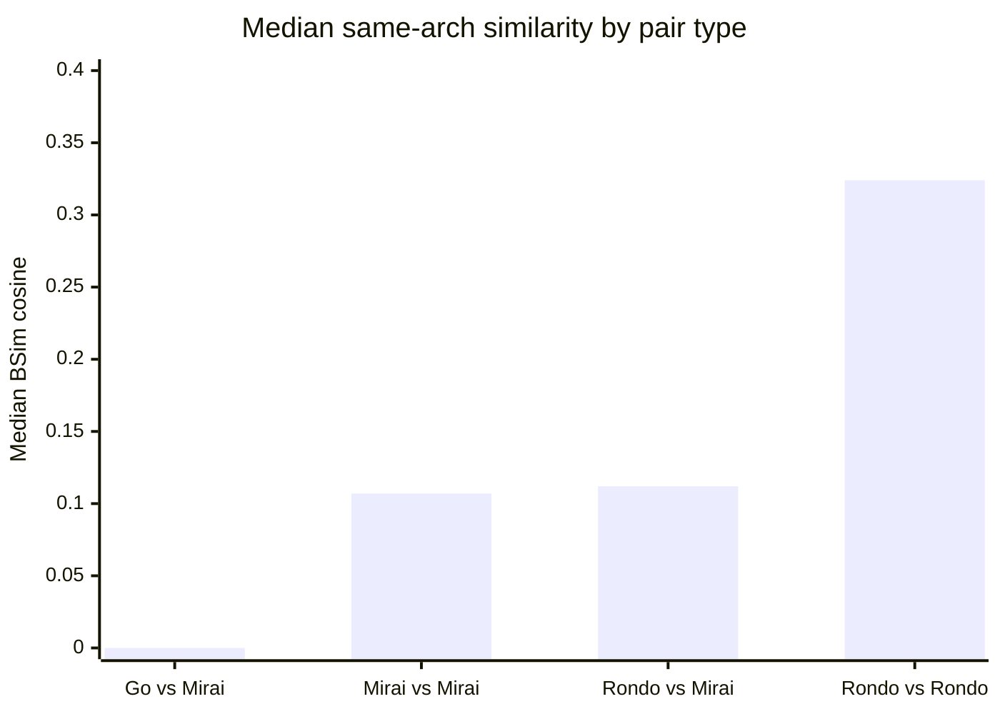
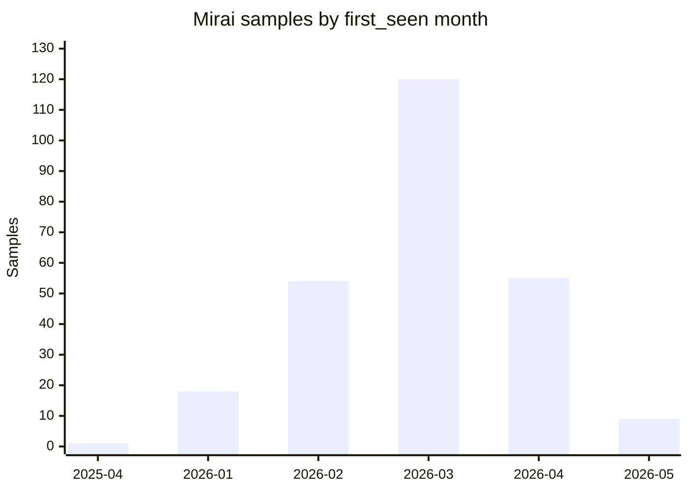
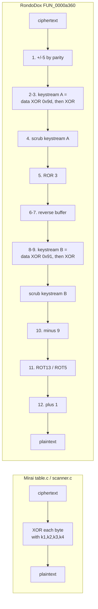
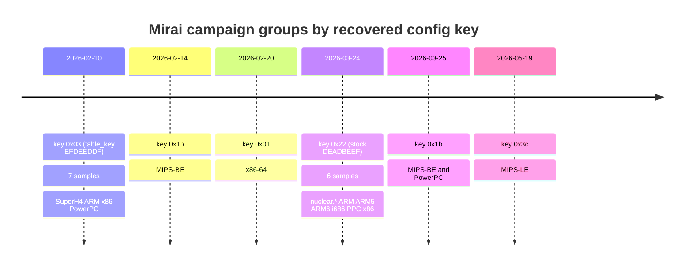

# RondoDox vs Mirai — a BSimVis family analysis

**Corpus:** BSimVis pool `4fb87d35-1e7e-4dff-aee8-6e9bf8db6086` ("mirai_unpacked_and_renamed3, RondoDox Pool")
**Collections:** `mirai_unpacked_and_renamed3` (258 files) · `RondoDox` (18 files)
**Scale:** 276 files · 113,698 functions · 693,675 cross-family function similarities · 2,667 function clusters
**Date of analysis:** 2026-08-05 · all BSimVis queries read-only (GET), no instance state modified

---

## 0. What this report answers

| Question asked | Short answer | Section |
|---|---|---|
| What is Mirai? | Open-sourced 2016 IoT botnet; 258 samples here across 12 ISAs, Jan–May 2026 | [§3](#3-what-is-mirai) |
| How do Mirai's encrypted tables work? | Per-byte XOR against the 4 bytes of `table_key`, folding to one effective byte | [§4](#4-how-mirais-encrypted-tables-actually-work) |
| Is there divergent Mirai? | **Yes — 5 distinct keys recovered; only 33% still use stock `0xDEADBEEF`** | [§4.3](#43-key-census-across-the-corpus) |
| What is RondoDox? | Exploit-shotgun IoT botnet, 2025→2026; 18 samples across 10 ISAs | [§5](#5-what-is-rondodox) |
| Does Rondo have XOR tables, or another scheme? | **Neither exactly — a 12-stage layered transform that *contains* two keyed XOR passes** | [§6](#6-rondos-string-protection-a-layered-transform-not-a-xor-table) |
| What do they share? | Almost entirely uClibc. **92.4%** of shared functions sit in libc-named clusters | [§7](#7-what-they-share) |
| What doesn't Rondo share / what does it add? | Anti-debug, config hygiene, layered crypto, key discipline | [§8](#8-what-they-do-not-share) |
| Can we see a Rondo evolution? | **No — negative result.** The metadata to do it does not exist for Rondo | [§10](#10-timelines) |

Three findings are worth flagging up front because they change how the rest should be read:

1. **Whole-binary similarity cannot attribute these families.** Mirai↔Mirai scores
   (median 0.107) are statistically indistinguishable from Rondo↔Mirai (0.112) at
   equal architecture. See [§2.3](#23-the-negative-control-that-makes-the-rest-trustworthy).
2. **8 of the 258 "Mirai" samples are not Mirai.** They are symbol-bearing Go
   binaries holding 33% of the collection's functions. See [§2.4](#24-corpus-hygiene-eight-go-binaries).
3. **Rondo's obfuscation does not match the published description.** No sample uses
   the publicly reported single-byte `0x21` key. See [§6.3](#63-this-contradicts-the-published-description).

---

## 1. Method and its limits

BSimVis compares functions by cosine similarity over **BSim feature vectors** — hashes
of normalised decompiled-code structure produced by Ghidra. It is a *semantic* measure:
it survives recompilation and light refactoring, and it does **not** depend on strings,
symbols, or byte patterns.

Pool parameters, read from `GET /api/pool/4fb87d35-...`:

```
algo                 unweighted_cosine
func_sim_params      top_k=1000  min_score=0.9  min_features=10
file_sim_params      top_k=100   min_score=0.5
cluster_algo         hdbscan (min_cluster_size=2, min_samples=1, epsilon=0.001)
only_cross_collection true
total_func_similarities 693675    total_func_clusters 2667
total_file_similarities   3939    total_file_clusters    0
```

Four limits govern every claim below.

**Class imbalance — 258 Mirai vs 18 Rondo (14:1).** No raw count is comparable. All
figures are normalised per sample or per architecture. "Rondo lacks X" is inherently a
much weaker statement than "Mirai lacks X": there are 14× fewer Rondo samples for X to
appear in.

**Architecture dominates the score.** Comparison is only meaningful within one ISA. In
this corpus, same-architecture cross-family pairs have median score 0.112; the same
pairs across architectures collapse to 0.020 — a **5.6× difference** driven purely by
instruction set, not by code lineage.

| Cross-family pairs | n | min | q1 | median | q3 | max |
|---|---|---|---|---|---|---|
| Same architecture | 494 | 0.000 | 0.046 | **0.112** | 0.229 | 0.622 |
| Different architecture | 3,301 | 0.000 | 0.005 | **0.020** | 0.040 | 0.596 |

Everything downstream therefore uses same-architecture pairs only.

**Static linking floods the signal.** These are statically linked uClibc ELFs. Most
functions in any sample are C library code that both families inherit from the same
toolchain, not from each other. Quantified in [§7](#7-what-they-share).

**`only_cross_collection=true`** means the pool stores Rondo↔Mirai similarities only.
Within-family baselines in this report were obtained from *collection-scoped* queries
(`GET /api/bin_sim/search?collection=<c>`), which are precomputed independently — 33,153
Mirai↔Mirai and 153 Rondo↔Rondo pairs. No pool rebuild was needed and no write was made.

### 1.1 Architecture coverage

Both families are broadly multi-architecture, which is itself a shared trait — and one
that reflects the same IoT target surface rather than shared code.

| Architecture | Rondo | Mirai |
|---|---:|---:|
| ARM:LE:32:v8 | 4 | 62 |
| MIPS:LE:32 | 1 | 44 |
| MIPS:BE:32 | 2 | 35 |
| x86:LE:32 | 3 | 29 |
| SuperH4:LE:32 | 1 | 18 |
| PowerPC:BE:32:e500 | 2 | 17 |
| x86:LE:64 | 1 | 16 |
| 68000:BE:32:Coldfire | 1 | 16 |
| sparc:BE:32 | 1 | 8 |
| AARCH64:LE:64 | 0 | 4 |
| MIPS:LE:64 | 0 | 3 |
| **Loongarch:LE:64:lp64d** | 0 | **2** |
| ARM:LEBE:32:v8LEInstruction | 2 | 0 |

Two entries deserve comment. Mirai here targets **Loongarch** — a Chinese-domestic ISA
whose appearance in commodity IoT malware indicates the build farm tracks new device
platforms. And Rondo's two `ARM:LEBE` samples have **no Mirai counterpart at all**, so
they are structurally unpairable in this corpus.

### 1.2 Exclusions

- **6 Mirai samples with <20 functions** (3× MIPS-LE, 2× MIPS-BE, 1× sparc) are failed
  analyses, not tiny malware. Excluded from aggregates, named rather than averaged away.
- **8 Go binaries** — see [§2.4](#24-corpus-hygiene-eight-go-binaries).
- **72 Mirai samples carry a `UPX_Protector` yara hit**, but the collection genuinely is
  unpacked: those 72 have a median of 200 functions (max 932). The yara fires on residual
  packer artefacts in the unpacked output, not on live packing. They are **kept**.

---

## 2. What the similarity numbers actually say

### 2.1 Whole-binary comparison

Same architecture, Go binaries excluded:

| Comparison | n | min | q1 | median | q3 | max |
|---|---:|---:|---:|---:|---:|---:|
| Mirai ↔ Mirai | 4,142 | 0.000 | 0.009 | **0.107** | 0.271 | 1.000 |
| Rondo ↔ Rondo | 12 | 0.163 | 0.274 | **0.324** | 0.815 | 0.997 |
| Rondo ↔ Mirai | 494 | 0.000 | 0.046 | **0.112** | 0.229 | 0.622 |

### 2.2 The result that matters

**Mirai↔Mirai (0.107) and Rondo↔Mirai (0.112) are the same number.** Two samples of the
*same* family resemble each other no more than a Rondo sample resembles a Mirai sample.

This is not evidence that Rondo *is* Mirai. It is evidence that **whole-binary BSim score
is not a family discriminator for statically linked IoT ELFs**. Both distributions sit on
a common floor created by the shared uClibc, and that floor swamps the few hundred
functions of actual botnet logic.

Anyone using a whole-binary similarity threshold to attribute these families would be
reading library linkage and calling it lineage.

Rondo↔Rondo is higher (0.324) — but n=12, and it is inflated by two near-identical
pairs (0.997, 0.957). It should not be treated as a reliable within-family baseline.

### 2.3 The negative control that makes the rest trustworthy

The 8 Go binaries provide an unplanned but excellent control: genuinely unrelated code,
same corpus, same pipeline, same architectures.

| Comparison | n | median | max |
|---|---:|---:|---:|
| Go ↔ Mirai (same arch) | 260 | **0.000** | 0.068 |
| Go ↔ Go (any arch) | 28 | 0.060 | 1.000 |

Go-versus-C scores **0.000**. The metric is not broken — it discriminates sharply when
code really is unrelated. Which is precisely why the 0.107 ≈ 0.112 collision in §2.2 has
to be read as a shared-libc floor rather than as noise.



### 2.4 Corpus hygiene: eight Go binaries

Eight samples in `mirai_unpacked_and_renamed3` are **Go binaries with full symbol
tables** (~900 `runtime.*` functions each). Mirai is C; these are not Mirai.

| md5 (first 12) | arch | funcs | first_seen |
|---|---|---:|---|
| b14c44765eb4 | ARM:LE:32:v8 | 4505 | 2026-04-05 |
| 4f8041818815 | ARM:LE:32:v8 | 4489 | 2026-04-05 |
| dc58bebcba7e | ARM:LE:32:v8 | 4478 | 2026-04-05 |
| e609c77b01d0 | MIPS:BE:32 | 4372 | 2026-04-05 |
| bded860e9282 | MIPS:BE:32 | 4364 | 2026-03-26 |
| c57c374c39a3 | x86:LE:64 | 4356 | 2026-04-05 |
| 33acdb3da37b | MIPS:LE:64 | 4300 | 2026-04-05 |
| 6999e2a2903b | MIPS:LE:64 | 4300 | 2026-03-26 |

They are the eight largest files in the collection and hold **35,164 of the collection's
107,331 functions — 33%**. They carry no yara hit and score 0.000 against real Mirai.
Their symbols include `crypto/md5.(*digest).Reset` and
`vendor/golang.org/x/crypto/internal/poly1305.initialize`.

Two build dates (2026-03-26, 2026-04-05) across four architectures indicate a
multi-arch Go build pipeline — the same cross-compilation discipline both C families use.

**Impact if unnoticed:** any unweighted function-level statistic over this collection
would have been one-third Go runtime. They are excluded from every aggregate in this
report. Identifying them is a corpus-curation action item, not just an analysis note.

---

## 3. What is Mirai

Mirai is the IoT botnet whose source was published in 2016, making it the substrate for
essentially all commodity Linux IoT botnets since. Its bot has a small, stable
structure: `scanner.c` (telnet brute-forcing with an embedded credential table),
`killer.c` (kill competing malware and bind ports), `attack_*.c` (DDoS methods),
`resolv.c` (DNS), and `table.c` (an obfuscated configuration store).

### 3.1 As observed here

258 samples, 12 architectures, `first_seen` spanning 2025-04-04 → 2026-05-31 but with
99.6% in 2026:



Antivirus labelling confirms family but not much else — 24 distinct yara labels across
the set, the most common being `Backdoor_Linux_Mirai_E_xp` (14), then a long tail of
`_MTB`/`_xp` suffixed variants with 1–6 samples each. This label sprawl is typical and
is *not* a variant taxonomy; it is vendor clustering noise.

Only **2 unique C2 IPs** appear across the 16 samples carrying `cc_ip` metadata
(`143.20.185.245`, `202.155.10.112`).

Sample naming preserves campaign structure: `nuclear.{arm,arm5,arm6,i686,ppc,x86}`,
`boatnet.{mips,mpsl,sh4,x86_64}`, `DEMONS.{arm,arm6}`, and a series prefixed
`xnxnxnxnxnxnxnxn<arch>xnxn`. These name groups turn out to align exactly with
encryption-key groups — see [§4.3](#43-key-census-across-the-corpus).

---

## 4. How Mirai's encrypted tables actually work

### 4.1 The mechanism, from source

Mirai stores configuration (C2 domain, ports, process names to kill, watchdog paths) in
a table of obfuscated blobs decrypted only for the moment of use. From
[`mirai/bot/table.c`](https://github.com/jgamblin/Mirai-Source-Code/blob/master/mirai/bot/table.c):

```c
uint32_t table_key = 0xdeadbeef;

static void toggle_obf(uint8_t id)
{
    uint8_t k1 = table_key & 0xff,
            k2 = (table_key >> 8) & 0xff,
            k3 = (table_key >> 16) & 0xff,
            k4 = (table_key >> 24) & 0xff;

    for (i = 0; i < val->val_len; i++)
    {
        val->val[i] ^= k1;
        val->val[i] ^= k2;
        val->val[i] ^= k3;
        val->val[i] ^= k4;
    }
}
```

`table_unlock_val(id)` calls `toggle_obf(id)` to decrypt in place; calling it again
re-encrypts. The same construct is duplicated in `scanner.c` as `deobf()` for the telnet
credential table.

### 4.2 The property that makes it findable

XOR is associative, so XORing a byte against all four key bytes in sequence is
**equivalent to one XOR against their fold**:

> `0xEF ^ 0xBE ^ 0xAD ^ 0xDE = 0x22`

Stock Mirai's entire configuration encryption is therefore a **single-byte XOR with
0x22**. Whether that appears in the decompiler as four XORs or one depends purely on
whether the compiler constant-folded the loop body — which varies by architecture and
optimisation level, *not* by malware variant.

Both forms are present in this corpus, and recognising them as equivalent is what makes
a corpus-wide census possible. Unfolded, in `4d99226ed34af9f9` (ARM), function
`00012b10` — Mirai's `deobf()` rendered almost literally:

```c
int FUN_00012b10(undefined4 param_1,int *param_2)
{
    iVar1 = FUN_00012cec(param_1);            /* strlen  */
    *param_2 = iVar1;
    iVar1 = FUN_00014bbc(*param_2 + 1);       /* malloc  */
    FUN_00012f68(iVar1,param_1,*param_2 + 1); /* memcpy  */
    for (local_18 = 0; local_18 < *param_2; local_18 = local_18 + 1) {
        *(byte *)(local_18 + iVar1) = *(byte *)(local_18 + iVar1) ^ 0xdf;
        *(byte *)(local_18 + iVar1) = *(byte *)(local_18 + iVar1) ^ 0xed;
        *(byte *)(local_18 + iVar1) = *(byte *)(local_18 + iVar1) ^ 0xde;
        *(byte *)(local_18 + iVar1) = *(byte *)(local_18 + iVar1) ^ 0xef;
    }
    return iVar1;
}
```

Key bytes in application order are `k1=0xdf, k2=0xed, k3=0xde, k4=0xef`, so
`table_key = 0xEFDEEDDF` — **not** the stock value. Its fold is
`0xdf^0xed^0xde^0xef = 0x03`.

Folded, in `nuclear.i686` (x86), function `08059330` — this is Mirai's
`add_auth_entry()` from `scanner.c`, decoding a username and a password into the
telnet credential table:

```c
void FUN_08059330(void)
{
    iVar2 = FUN_08061a91(DAT_0806e4c8, DAT_0806e49c * 0x10 + 0x10);  /* realloc, 0x10-byte entries */
    ...
    if (0 < iVar3) {                       /* deobf(username) */
        do {
            *(byte *)(iVar5 + iVar4) = *(byte *)(iVar5 + iVar4) ^ 0x22;
            iVar5 = iVar5 + 1;
        } while (iVar3 != iVar5);
    }
    ...
    if (0 < iVar3) {                       /* deobf(password) */
        do {
            *(byte *)(iVar5 + iVar4) = *(byte *)(iVar5 + iVar4) ^ 0x22;
            iVar5 = iVar5 + 1;
        } while (iVar3 != iVar5);
    }
    *(char *)(iVar5 + 0xc + DAT_0806e4c8) = (char)iVar3;   /* username_len */
    *(char *)(DAT_0806e49c * 0x10 + 0xd + iVar5) = (char)iVar3; /* password_len */
    *(short *)(DAT_0806e49c * 0x10 + 8 + DAT_0806e4c8) = DAT_0806e4cc;          /* weight_min */
    *(short *)(DAT_0806e49c * 0x10 + 10 + iVar1) = DAT_0806e4cc + in_CX;        /* weight_max */
    DAT_0806e49c = DAT_0806e49c + 1;       /* auth_table_len++ */
    DAT_0806e4cc = DAT_0806e4cc + in_CX;   /* auth_table_max_weight += weight */
}
```

The 0x10-byte entry stride, the two length fields at +0xc/+0xd, and the weight_min /
weight_max pair at +8/+0xa match the source struct field-for-field. `0x22` confirms this
sample retains **stock `0xDEADBEEF`**.

### 4.3 Key census across the corpus

Every non-Go Mirai sample (250) and every Rondo sample (18) was scanned: all decompiled
function bodies pulled, then filtered for a byte-wise XOR inside a length loop.

18 of 250 Mirai samples yielded a recoverable key. **Five distinct effective keys:**

| Effective key | Samples | Form found | `table_key` | Campaign / naming | Dates |
|---|---:|---|---|---|---|
| **0x03** | 7 | 5 folded (`3`), 2 unfolded | `0xEFDEEDDF` | unnamed md5 set | 2026-02-10 |
| **0x22** | 6 | folded | `0xDEADBEEF` **(stock)** | `nuclear.*` | 2026-03-24 |
| **0x1b** | 3 | folded | — | `xnxnxnxn…` | 2026-02-14, 2026-03-25 |
| **0x01** | 1 | folded | — | `bin.x86_64` | 2026-02-20 |
| **0x3c** | 1 | folded | — | `wife.mpsl` | 2026-05-19 |

Three things fall out of this table.

**Divergent Mirai is confirmed and quantified.** Only 6 of 18 keyed samples (33%) still
use stock `0xDEADBEEF`. Key modification is the majority behaviour, consistent with
public reporting of variant keys such as Wicked (`0x37`), Satori v3 (`0x07`),
SORA (`0xdedefbaf`) and Nexcorium (`0x13`/`0xFD`).

**Keys partition by campaign, not by architecture.** The 0x03 group spans SuperH4, ARM,
x86 and PowerPC on a single day; the 0x22 group spans ARM, ARM5, ARM6, i686, PPC and x86
on another. Each group is one operator's cross-compiled build set. **The key is a better
campaign fingerprint than the AV label**, which scattered these same samples across a
dozen `_MTB` names.

**The folding equivalence is validated in-corpus.** Within the 0x03 group, two ARM
samples show unfolded `0xdf,0xed,0xde,0xef` while five others show a folded `3` — same
day, same campaign, same key, different compiler output. That is direct confirmation
that the two forms are the same thing, not two variants.

**Why only 18 of 250?** Absence of a detected loop is not absence of the scheme. It
means the decompiler did not render that shape — inlining, vectorisation, or
architecture-specific output. The census is a **lower bound**; the key *distribution*
among recovered samples is the finding, not the 7% recovery rate.

---

## 5. What is RondoDox

RondoDox is an IoT/web botnet campaign active since roughly May 2025, characterised in
public reporting by an "exploit shotgun" approach — spraying a very large set of CVEs
across routers, DVR/NVR, CCTV and web platforms rather than relying on credential
brute-forcing. [Bitsight](https://www.bitsight.com/blog/rondodox-botnet-infrastructure-analysis)
counts **174 distinct exploits** (148 CVE-mapped) by February 2026, with a shift from
broad spraying (June–October 2025) to focused exploitation of fresh CVEs from January
2026 — including [React2Shell / CVE-2025-55182](https://thehackernews.com/2026/01/rondodox-botnet-exploits-critical.html)
(CVSS 10.0).

Its relationship to Mirai is stated directly by both vendors:
[F5 Labs](https://www.f5.com/labs/articles/tracking-rondodox-malware-exploiting-many-iot-vulnerabilities)
calls it "a variation on Mirai"; Bitsight says it "shares a lot of commonalities with
Mirai (which is not surprising, given Mirai's source code is open source)" while noting
the key behavioural split — **RondoDox is solely a DoS platform**, without Mirai's
integrated scanning/propagation. RondoDox campaigns have also been observed *deploying*
a Mirai-based x86 payload alongside their own, which means "Rondo and Mirai on the same
host" is an operational reality and not only a code-similarity question.

### 5.1 As observed here

18 samples across 10 architectures. Filenames are the samples' own SHA-256 — no
enrichment metadata of any kind is attached (see [§10](#10-timelines)).

| Sample | Arch | Funcs | Keys recovered |
|---|---|---:|---|
| `rondo.5.jpg` | MIPS:BE:32 | 785 | (constants present, loop not rendered) |
| `67219e97…` | ARM:LEBE:32 | 717 | `0x91919191`,`0x9d9d9d9d`,`0xb4`,`0xf7f7f7f7` |
| `848464e4…` | ARM:LEBE:32 | 717 | `0x91919191`,`0x9d9d9d9d`,`0xb4`,`0xf7f7f7f7` |
| `2d6cb85f…` | ARM:LE:32:v8 | 335 | `0x91`,`0x9d` |
| `a78f8c90…` | 68000:Coldfire | 318 | — |
| `f6dd15cb…` | ARM:LE:32:v8 | 309 | `0x91`,`0x9d` |
| `e2c0b7f6…` | ARM:LE:32:v8 | 293 | `0x91`,`0x9d` |
| `57f9ba41…` | PowerPC:e500 | 278 | `0x91`,`0x9d` |
| `7732e3ac…` | x86:LE:32 | 275 | — |
| `c7faf8d3…` | PowerPC:e500 | 275 | `0x91`,`0x9d` |
| `9affdd73…` | ARM:LE:32:v8 | 274 | `0x91`,`0x9d` |
| `a501ee00…` | sparc:BE:32 | 270 | — |
| `eb40a3a7…` | x86:LE:32 | 269 | — |
| `8d87fd06…` | x86:LE:32 | 268 | — |
| `35d90098…` | SuperH4:LE:32 | 266 | `0x91`,`0x9d` |
| `7aeb450c…` | x86:LE:64 | 262 | — |
| `31e825d0…` | MIPS:BE:32 | 228 | — |
| `d2fe03bc…` | MIPS:LE:32 | 228 | — |

**`rondo.5.jpg` is not an image.** It is a 785-function MIPS-BE ELF carrying Rondo's
`0x91`/`0x9d` key constants. The `.jpg` extension is either delivery-side disguise or a
collection artefact; either way it is a full Rondo binary and belongs in the corpus.

The corpus splits into two builds: a **main set** of 228–335 functions covering 10
architectures, and a **fat pair** of 717-function `ARM:LEBE` binaries whose XOR
constants appear in vectorised word form (`0x9d9d9d9d`) plus an extra `0xb4` used 22
times. Those two are 0.997 similar to each other — the same build twice.

---

## 6. Rondo's string protection: a layered transform, not a XOR table

This is the central technical question, and the answer is a clear no to "Rondo has XOR
tables like Mirai".

### 6.1 The routine

From `2d6cb85f…` (ARM), function `0000a360`, recovered in full. It is a
**twelve-stage in-place transform** over a length-prefixed buffer:

```c
void FUN_0000a360(int param_1,int param_2)
{
    uVar7 = param_2 - 1;

    /* [1] alternating additive shift by index parity */
    do {
        if ((uVar6 & 1) == 0)  *(char *)(uVar6+param_1) = *(char *)(uVar6+param_1) + -5;
        else                   *(char *)(uVar6+param_1) = *(char *)(uVar6+param_1) + '\x05';
    } while (uVar7 != uVar6);

    /* [2] derive a 64-byte keystream from static data, keyed with 0x9d */
    local_82[0] = 0x43;
    do { local_82[iVar4] = (&DAT_00028da4)[iVar4] ^ 0x9d; } while (iVar4 != 0x40);

    /* [3] XOR the buffer against that keystream (indexed, not a constant) */
    do { *(byte *)(uVar6+param_1) = *(byte *)(uVar6+param_1) ^ local_82[extraout_r1]; }
    while (uVar7 != uVar6);

    /* [4] scrub the keystream from the stack */
    FUN_0001d0e0(local_82,0,0x41);

    /* [5] rotate every byte right by 3 */
    do { *(byte *)(uVar6+param_1) =
             (byte)((int)(uint)*(byte *)(uVar6+param_1) >> 3) | *(byte *)(uVar6+param_1) << 5;
    } while (uVar7 != uVar6);

    /* [6] reverse the buffer end-for-end, then [7] a quarter-length second swap */
    ...
    /* [8] derive a second 32-byte keystream, keyed with 0x91 */
    local_41[0] = 0x36;
    do { local_41[iVar4] = (&DAT_00028de4)[iVar4] ^ 0x91; } while (iVar4 != 0x20);

    /* [9] XOR against keystream 2, then scrub it too */
    do { *(byte *)(uVar6+param_1) = *(byte *)(uVar6+param_1) ^ local_41[extraout_r1_00]; }
    while (uVar7 != uVar6);
    FUN_0001d0e0(local_41,0,0x21);

    /* [10] subtract 9 from every byte */
    do { *(char *)(uVar6+param_1) = *(char *)(uVar6+param_1) + -9; } while (uVar7 != uVar6);

    /* [11] ROT13 on letters, ROT5 on digits */
    ...  (uVar3 - 0x54) % 0x1a + 'a'      /* 0x61 - 13 = 0x54  -> ROT13 lower */
    ...  (uVar3 - 0x34) % 0x1a + 'A'      /* 0x41 - 13 = 0x34  -> ROT13 upper */
    ...  (uVar3 - 0x2b) % 10   + '0'      /* 0x30 -  5 = 0x2b  -> ROT5  digit */

    /* [12] add 1 to every byte */
    do { *(char *)(uVar6+param_1) = *(char *)(uVar6+param_1) + '\x01'; } while (uVar6 < uVar7);
}
```

### 6.2 How this differs from Mirai



| Property | Mirai | RondoDox |
|---|---|---|
| Stages | 1 | 12 |
| Key material | one 32-bit constant | two static tables (64 B, 32 B), each unmasked with its own byte key |
| XOR operand | a constant | an **indexed keystream** — position-dependent |
| Reversible by | XOR with one byte | inverting 12 ordered stages |
| Key hygiene | key is a global | keystreams built on stack, **wiped after use** |
| Recoverable by | frequency analysis / one-byte brute force | not by brute force; requires reimplementing the chain |

`0x91` and `0x9d` are **not** the encryption keys in Mirai's sense. They are masks
applied to static data to *materialise* the keystreams. Calling Rondo's scheme "XOR with
0x91" would be as wrong as calling Mirai's "XOR with `table_key`'s high byte".

The stack-scrubbing (stages 4 and 8) is the tell that this is deliberately
anti-analysis: keystreams do not persist in memory after use, so a memory dump taken
after string decryption yields plaintext but not the means to decrypt anything else.

### 6.3 This contradicts the published description

[ANY.RUN's RondoDox overview](https://medium.com/@anyrun/rondodox-malware-overview-e5c889e13642)
states RondoDox "employs XOR obfuscation using the hexadecimal key 0x21 to encode its
configuration data, including file paths, tool filenames, and C2 server addresses."

**No sample in this corpus uses `0x21`.** Checked across all 18: zero occurrences of the
constant anywhere in any decompiled function body. All 18 carry the `0x91`/`0x9d` key
material instead — 16 in scalar form, 2 in vectorised word form (`0x91919191`,
`0x9d9d9d9d`) — and 9 have the full layered routine rendered by the decompiler.

The most likely reconciliation is that the published `0x21` describes the **shell-script
loader or an earlier v1 ELF**, while these 18 are a later generation that replaced
single-byte XOR with the layered transform. Either way, the operational consequence is
concrete: **a `0x21` XOR decoder will not extract configuration from these samples.**

This also resolves Bitsight's observation that RondoDox C2 IPs "are encrypted in the
samples, which requires more active analysis to obtain" — §6.1 is the reason why.

---

## 7. What they share

### 7.1 The measurement

700 clusters (all with ≥4 members) were profiled for family composition via
`GET /api/cluster/functions`. 687 contain both Rondo and Mirai functions — expected,
since the pool was built with `only_cross_collection=true`.

BSimVis resolves cluster names from symbol-bearing members, which — thanks to the Go
binaries and partially-symbolised samples — gives a free library oracle even though the
malware samples themselves are stripped.

Of **94,477** sampled cross-family cluster members, **87,325 sit in symbol-named
(libc/Go) clusters — 92.4%.**

| Cross-family cluster name kind | Clusters |
|---|---:|
| libc-symbol named (`__stdio_rfill`, `vfscanf`, `inet_ntop`, `strncpy`, `__uClibc_main`…) | 432 |
| unnamed (`FUN_*`) | 90 |
| other named (`fputs`, `atoi`, `tcgetattr`, `sbrk`, `getegid` — also libc) | 142 |
| Go runtime named | 23 |

The most-populated shared clusters are `__stdio_rfill` (71 clusters), `__xstat64_conv`
(36), `__stdio_wcommit` (29), `__init_scan_cookie` (18), `__encode_header` (15) — uClibc
stdio, stat, and resolver internals.

### 7.2 The unnamed clusters are libc too

The obvious objection is that the 90 unnamed `FUN_*` clusters are where the real shared
malware code hides. They are not. Taking the most balanced one — cluster `8290c3638e54`,
14 Rondo functions against 17 Mirai functions, 85 features, present in 31 distinct
files — and decompiling a member resolves it immediately:

```c
uint FUN_0041eea0(byte param_1,ushort *param_2)
{
    pbVar3 = *(byte **)(param_2 + 8);
    if (pbVar3 < *(byte **)(param_2 + 0xe)) {  /* fast path: room in buffer */
        *pbVar3 = param_1;
        *(byte **)(param_2 + 8) = pbVar3 + 1;
    }
    ...
    if ((*param_2 & 0x100) == 0) return uVar2;
    if (uVar2 != 10) return uVar2;             /* line-buffered: flush on '\n' */
    iVar1 = FUN_0041d330(param_2);             /* fflush */
}
```

That is `putc`/`__fputc_unlocked` — the FILE buffer fast path with line-buffered flush
on newline. Unnamed in the cluster only because no member of *that* cluster happened to
carry a symbol.

Every high-feature unnamed cross-family cluster examined resolved the same way.

### 7.3 So what is actually shared

**Answer: the C runtime, and the design pattern — not code.**

The genuine commonalities are architectural rather than textual:

- Both are statically linked uClibc ELFs built by near-identical cross-compilation
  toolchains for the same ~10 IoT architectures.
- Both obfuscate configuration in the binary and decrypt at point of use.
- Both target the same device classes and pursue DDoS as the monetisation.
- Both are built as per-architecture sets in a single campaign push.

What is **not** present is shared *botnet* code. Given that BSim compares decompiled
semantics — and demonstrably scores 0.000 on genuinely unrelated Go code in the same
pipeline — no meaningful body of shared `attack_*`, `scanner`, `killer` or C2 logic
survived the libc filter.

This is a **negative result on shared lineage**, and it is worth stating plainly: vendor
descriptions of RondoDox as "a Mirai variant" are not supported by function-level code
similarity in this corpus. They are consistent with RondoDox being an *independent
reimplementation* of the same design, by people who read the same leaked source.

**Caveat that limits this claim.** BSim's `min_features=10` floor discards small
functions, and much of Mirai's distinctive logic (`attack_udp_generic`, killer helpers)
is small. Absence of shared botnet clusters is strong evidence against wholesale code
reuse, weaker evidence against selective reuse of individual small routines.

---

## 8. What they do not share

The clearest divergences come from what each binary leaves in the clear. Contrasting
full decompiled-literal extraction from one sample of each family, same method:

**Mirai `nuclear.i686` — 28 literals, operationally revealing:**

| Literal | Meaning |
|---|---|
| `raw.flameblox.com` | **C2 domain, in cleartext** |
| `/bin/busybox`, `ftpget` | scanner payload delivery |
| `/proc/%d/cmdline`, `/proc/%s/exe`, `/proc/self/exe` | `killer.c` competitor hunting |
| `ssdp:discover…USER-AGENT: Google Chrome/6…` | SSDP scan/amplification probe |
| `SNQUERY: 127.0.0.1:AAAAAA:xsvr` | known Mirai-lineage probe string |
| `abcdefghijklmnopqrstuvwxyzABC…` | random-string generation |

**Rondo `2d6cb85f…` — 22 literals, operationally silent:**

| Literal | Meaning |
|---|---|
| `/proc/%d/status`, `Pid:\t%d`, **`TracerPid:`**, `TracerPid:\t%d` | **anti-debugging — ptrace detection** |
| `/proc/cpuinfo`, `/proc/stat`, `/sys/devices/system/cpu`, `processor` | host/VM profiling |
| `/bin/sh`, `exit 0` | command execution |
| `/dev/null` | output suppression |

Everything else in the Rondo list is libc format-string machinery.

**There is no C2, no domain, no IP, no tool path, and no attack string in Rondo's
cleartext.** All of it is behind the §6 transform. Mirai, by contrast, XORs its
credential table with one byte and then leaves its C2 domain in plain sight.

`TracerPid:` is the decisive one. Reading `/proc/<pid>/status` and parsing `TracerPid:`
is the standard Linux self-debugger check — a nonzero value means a debugger is attached.
**Nothing equivalent exists in Mirai's source or in any Mirai sample examined here.**

### 8.1 Capability matrix

Evidence keys: **[B]** this binary corpus · **[O]** open-source reporting, cited · **[–]** not observed

| Capability | Mirai (here) | RondoDox (here) |
|---|---|---|
| Config obfuscation | 1-stage XOR, key folds to 1 byte **[B]** | 12-stage layered transform, 2 keystreams **[B]** |
| Key hygiene | global constant, persists **[B]** | stack keystreams, **wiped after use [B]** |
| Key variation across corpus | **5 distinct keys** / 18 samples **[B]** | **1 scheme**, 0 variation / 18 samples **[B]** |
| Cleartext C2 in binary | **yes** — `raw.flameblox.com` **[B]** | **no** — none found **[B]** |
| Anti-debugging | **–** | **TracerPid ptrace check [B]** |
| Host/VM profiling | **–** | `/proc/cpuinfo`, `/sys/devices/system/cpu` **[B]** |
| Propagation | telnet brute-force, credential table **[B]** | exploit shotgun, 174 exploits **[O]** |
| Primary purpose | DDoS + scanning/spreading **[B][O]** | **DDoS only [O]** |
| Anti-competition | `killer.c` `/proc` walk **[B]** | kills competitors, renames `iptables` **[O]** |
| Persistence | minimal (memory-resident) **[O]** | cron, symlinks, startup files, self-heal **[O]** |
| Architectures | 12 **[B]** (incl. Loongarch) | 10 **[B]** |
| C2 protocol | Mirai binary protocol **[B][O]** | port 345 / HTTP, base64 commands **[O]** |
| Traffic mimicry | **–** | OpenVPN/Fortnite magic bytes **[O]** |

### 8.2 What Rondo has more of

1. **Materially stronger config protection** — §6, the single most defensible finding.
2. **Anti-debugging** Mirai does not have at all.
3. **Environment profiling** before execution.
4. **Operational hygiene** — no cleartext IoCs, so a strings-based YARA rule that would
   catch Mirai's C2 catches nothing in Rondo.
5. **Breadth of initial access** — 174 exploits **[O]** versus credential brute-forcing.

### 8.3 What Mirai has more of

1. **Self-propagation.** Rondo is delivered; Mirai spreads itself.
2. **Architecture reach** — 12 vs 10, including Loongarch and AArch64.
3. **Ecosystem scale** — 258 vs 18 samples here, five concurrent key variants, evidence
   of many independent operators. Rondo's single unvaried scheme suggests one team.

---

## 9. Are they the same family?

**No — and the evidence separates cleanly by layer.**

| Layer | Verdict |
|---|---|
| Whole-binary similarity | **Cannot distinguish** — 0.107 within-Mirai vs 0.112 cross-family. Unusable for attribution here. |
| Function clusters | **92.4% of shared functions are libc.** No shared botnet-logic cluster survived. |
| Config encryption | **Different in kind** — 1 stage vs 12; constant XOR vs indexed keystreams. |
| Cleartext artefacts | **Opposite postures** — Mirai leaks C2; Rondo leaks nothing. |
| Anti-analysis | **Rondo only.** |
| Design pattern | **Shared** — same targets, same toolchains, same obfuscate-then-decrypt-in-place idea. |

RondoDox is best described as a **design descendant** of Mirai, not a code fork.
It solves the same problems the same way at the architectural level, while sharing no
demonstrable implementation. The vendor shorthand "Mirai variant" is defensible as
threat-taxonomy labelling and is **not** supported as a statement about code.

---

## 10. Timelines

### 10.1 Mirai — buildable, and it works

257 of 258 samples carry `first_seen`. The distribution is a burst campaign peaking in
March 2026 ([§3.1](#31-as-observed-here)), and it correlates with the key census:



Each key group is one operator's cross-compiled build set, released on one day across
several architectures. Distinct keys appear concurrently, so this is **several operators
running in parallel**, not one lineage evolving. The `0x1b` group recurring six weeks
apart (2026-02-14 and 2026-03-25) is the only visible instance of key *reuse* across
time — a single operator returning with the same build.

### 10.2 Rondo — negative result

**A RondoDox evolution timeline cannot be produced from this corpus.**

- All 18 samples have **no `first_seen`, no `last_seen`, no `yara`, no `avtype`, no
  `cc_ip`, and no tags.** Zero enrichment.
- `entry_date` records only upload time — all 18 landed within minutes of each other and
  carry no intelligence value.
- Attempts to date the samples externally by their SHA-256 filenames returned nothing.

What *can* be said is structural, not temporal: the corpus contains **two builds** — a
main set (228–335 functions, 10 architectures, scalar `0x91`/`0x9d`) and a fat
`ARM:LEBE` pair (717 functions, vectorised constants plus `0xb4`) that are 0.997
identical to each other. That is a build-variant split with no evidence about ordering.

**To get a real Rondo capability timeline you would need**, in order of impact:

1. Rondo samples with `first_seen` populated — a feed with sighting dates, which is what
   the Mirai collection has and this one does not.
2. Samples spanning the reported v1 → v2 transition, so the `0x21` → layered-transform
   change in [§6.3](#63-this-contradicts-the-published-description) can be dated.
3. Sample counts per month comparable to Mirai's (tens, not two), to distinguish a build
   change from sampling noise.

With those, the same key-census method that produced §10.1 would apply directly:
the deobfuscation routine is a **stable, high-signal version fingerprint** in both families.

---

## 11. Confidence and gaps

| Finding | Confidence | Basis |
|---|---|---|
| Mirai config XOR mechanism and folding equivalence | **High** | Source + 2 decompiled forms, cross-validated in-corpus |
| 5 distinct Mirai keys; only 33% stock | **High** for the 18 recovered; **not** a population rate | Full scan of 250 samples |
| Rondo uses a 12-stage layered transform | **High** | Full routine recovered; key material in 18/18 samples, routine rendered in 9 |
| No Rondo sample uses `0x21` | **High** | Exhaustive constant scan, all 18 |
| 92.4% of shared functions are libc | **High** | 700 clusters profiled; spot-checked by decompilation |
| Whole-binary score cannot attribute | **High** | 0.107 vs 0.112, with Go control at 0.000 |
| No shared botnet code | **Medium-high** | Strong against wholesale reuse; weaker against selective small-function reuse (`min_features=10` floor) |
| Rondo has anti-debug, Mirai does not | **Medium-high** | `TracerPid` in Rondo; absent in Mirai source and samples examined |
| 8 Go binaries are not Mirai | **High** | Go symbols, 0.000 vs Mirai, no yara |
| Rondo timeline | **Negative result** | Metadata absent; external dating failed |

### Gaps

- **Key recovery rate is 7% (18/250).** The distribution among recovered samples is the
  finding; the recovery rate is a decompiler-rendering artefact and should not be read
  as "93% of Mirai has no config encryption".
- **No strings endpoint exists in BSimVis.** All literal evidence in [§8](#8-what-they-do-not-share)
  comes from decompiled function bodies, which surfaces referenced literals but not the
  full `.rodata` string table. A true strings pass would likely find more IoCs in both
  families.
- **Rondo's static keystream tables** (`DAT_00028da4`, `DAT_00028de4`) were not
  extracted — data-section reads are outside what the API exposes. Without them the
  transform is documented but not yet *executable* as a decryptor.
- **Capability rows marked [O]** (persistence, C2 protocol, exploit count, traffic
  mimicry) are vendor-reported and unverified here.
- **Rondo↔Rondo baseline is n=12** and should not be over-read.

### Recommended next steps

1. **Extract the two Rondo keystream tables** and implement the 12-stage inverse. That
   turns §6 from a description into a working config extractor — highest value.
2. **Re-tag the 8 Go binaries** out of the Mirai collection.
3. **Add sighting dates to the Rondo collection**; without them §10.2 stays a negative.
4. **Run the key census as a standing job.** The deobfuscation key is a better campaign
   fingerprint than AV labels, and it is cheap to compute.

---

## Appendix A — reproducing this

Every figure is re-derivable from read-only GETs against the instance on port 5001.

```bash
POOL=4fb87d35-1e7e-4dff-aee8-6e9bf8db6086

# Pool configuration and totals (§1)
curl -s "localhost:5001/api/pool/$POOL"

# Corpus inventory, both collections (§1.1, §5.1)
curl -s "localhost:5001/api/file/search?collection=RondoDox&limit=50"
curl -s "localhost:5001/api/file/search?collection=mirai_unpacked_and_renamed3&limit=500"

# Cross-family whole-binary pairs, 3939 (§2.1)
curl -s "localhost:5001/api/bin_sim/search?pool=$POOL&limit=500&offset=0"

# Within-family baselines — collection-scoped, not pool-scoped (§2.1)
curl -s "localhost:5001/api/bin_sim/search?collection=RondoDox&limit=500"
curl -s "localhost:5001/api/bin_sim/search?collection=mirai_unpacked_and_renamed3&limit=500"

# Clusters and their family composition (§7)
curl -s "localhost:5001/api/cluster/list?pool=$POOL&limit=500"
curl -s "localhost:5001/api/cluster/functions?pool=$POOL&cluster_uuid=8290c3638e54&limit=500"

# Identify the Go binaries (§2.4)
curl -s "localhost:5001/api/function/search?collection=mirai_unpacked_and_renamed3&function_name=runtime.&limit=500"

# The two decryption routines (§4.2, §6.1)
curl -s "localhost:5001/api/function/code?id=mirai_unpacked_and_renamed3:func:f7be80ba920da30c57acc630852e4209:08059330"
curl -s "localhost:5001/api/function/code?id=mirai_unpacked_and_renamed3:func:4d99226ed34af9f97717552634df055d:00012b10"
curl -s "localhost:5001/api/function/code?id=RondoDox:func:8f8609ec2f38f29dbeba6b30b855e117:0000a360"
```

The key census ([§4.3](#43-key-census-across-the-corpus)) pulls every decompiled function
body per sample and filters for a byte-wise XOR inside a length loop, normalising folded
and unfolded key forms to one effective byte:

```python
def effective_key(consts):
    """Mirai XORs each byte against all 4 bytes of table_key; compilers may fold
    them into one constant, or vectorise into words (0x9d9d9d9d). Normalise all
    three forms to a single effective byte."""
    bs = []
    for c in consts:
        v = int(c, 0)
        if v > 0xFF:                                  # vectorised word form
            b = v & 0xFF
            if all(((v >> (8*i)) & 0xFF) == b for i in range(4)):
                bs.append(b)
        else:
            bs.append(v)
    return functools.reduce(operator.xor, sorted(set(bs))) if bs else None

assert effective_key(['0xef','0xbe','0xad','0xde']) == 0x22   # stock DEADBEEF
assert effective_key(['0xdf','0xed','0xde','0xef']) == 0x03   # EFDEEDDF variant
assert effective_key(['0x22']) == 0x22                        # already folded
assert effective_key(['0x9d9d9d9d']) == 0x9d                  # vectorised
```

## Appendix B — sources

- [Mirai source, `mirai/bot/table.c`](https://github.com/jgamblin/Mirai-Source-Code/blob/master/mirai/bot/table.c)
- [Bitsight — RondoDox: From Zero to 174 Exploited Vulnerabilities](https://www.bitsight.com/blog/rondodox-botnet-infrastructure-analysis)
- [F5 Labs — Tracking RondoDox](https://www.f5.com/labs/articles/tracking-rondodox-malware-exploiting-many-iot-vulnerabilities)
- [ANY.RUN — RondoDox: Malware Overview](https://medium.com/@anyrun/rondodox-malware-overview-e5c889e13642)
- [The Hacker News — RondoDox exploits React2Shell (CVE-2025-55182)](https://thehackernews.com/2026/01/rondodox-botnet-exploits-critical.html)
- [NETSCOUT — OMG: Mirai Minions are Wicked](https://www.netscout.com/blog/asert/omg-mirai-minions-are-wicked) (variant key changes)
- [FortiGuard — Mirai variant Nexcorium](https://www.fortinet.com/blog/threat-research/tracking-mirai-variant-nexcorium-a-vulnerability-driven-iot-botnet-campaign) (keys 0x13/0xFD)
- [Nozomi — Updated Mirai botnet clones' modifications](https://www.nozominetworks.com/blog/exploring-modifications-in-new-mirai-botnet-clones)
