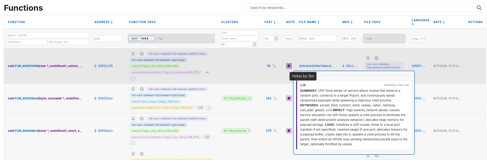
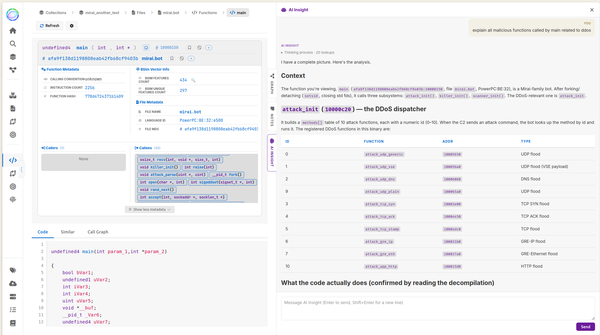
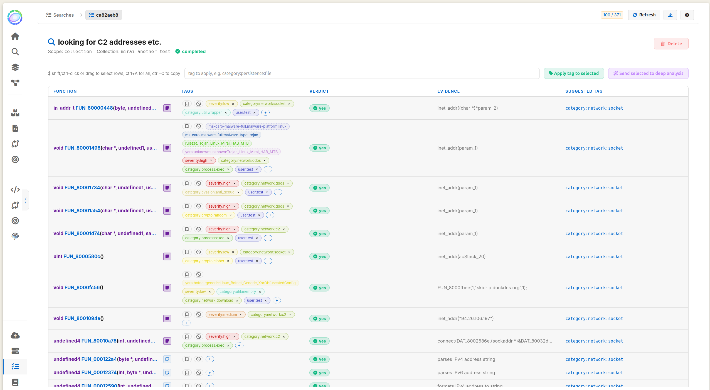
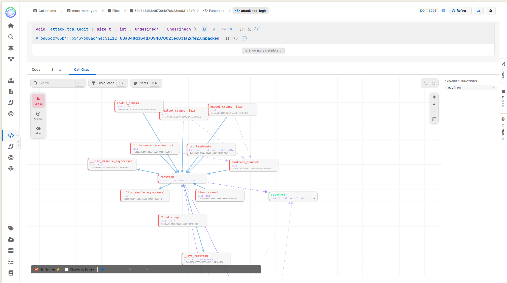

BSimVis is a tool to analyze similarities across a collection of binaries, based on [Ghidra](https://github.com/nationalsecurityagency/ghidra) analyzers and the BSim (Behavioral Similarity) plugin. It provides an API and Web interface to upload large quantities of decompiled binaries and BSim feature vectors to a Kvrocks database for similarity analysis, function diffing, and binary family clustering.

# New features

This release focuses on automated analysis, triage of functions, and file level similarities views and searches :
- Mandiant capa integration

- Yara rules, with a Rulezet.org API dump tool

- Ghidra FunctionID for standard library identification

- LLM analysis and tagging

The new binary similarity view allows to split the similarities based on these triage. 
Some optimisations for incremental build, and improved clustering. 

## Agentic LLM analysis
* **Integrated chat agent** — Interactive context aware assistant panel.

* **MCP server** — Exposes search, call graphs, tags, and similarities to external MCP clients.
* **Batch and pair analysis** — Whole-file reports, batch tagging, and comparative analysis of binary pairs.

## External analysis integrations for triage
* **YARA preanalysis** tags functions for fast triage and inisights, with an automated Rulezet.org synchronization tool. 
* **capa rule metadata & axes** — ATT&CK/MBC rule metadata is recorded and inherited onto function tags, carrying family/vuln/MITRE/MBC triage axes. 
* **Provenance** — hover an analysis tag to see the rule that created it and its documentation. 

## Nested files and packed files
* **Auto-unpacking pipeline** — Seamless extraction of code from container formats such as Android APKs, fat/universal Mach-O binaries, and ZIP/TAR archives.
* **UPX packer support** — Automatic decompression of UPX-packed binaries, preserving both the original packed sample and the unpacked child executable for side-by-side diffing and analysis.

## Binary similarity & Call graph
* **Code/Library/Content score axes** — for every similarity between two files, similarity score is now split between original code and standard library code.
* **Pivotick call graph** — recursive expansion with depth cap, similarity edges merged in, drag-and-drop/bulk-add, persistent side panel with locked side-by-side diff, and binary clustering with notes sync.

## Clustering
* **New clustering backend** — Threshold union-find replaces HDBSCAN for function clustering with incremental update, lowering drastically clustering time.

## Jobs and injesting
* **Reliable workflows** — Lease-based job scheduler, per-collection lanes, auto-unpacking of container files

## Search, UI & Security
* **Unified search** — Ctrl+K global search with streaming results.
* **Light theme** — Light mode support.
* **Security** — Hardened input escaping to prevent XSS.
